# Developing Transactional App Based on Managed Scenario

* [Anubhav Trainings Official Website](https://www.anubhavtrainings.com)
* [Anubhav Trainings Official Channel](https://www.youtube.com/@AnubhavOberoy)


# Developing Validations, Actions, Determinations and Feature Control

* [Exercise 1 - Setting Default Values]
* [Exercise 2 - Implementing the Action createTravelByTemplate]
* [Exercise 3 - Modeling Static and Dynamic Feature Control]
* [Exercise 4 - Implementing the Determination]
* [Exercise 5 - Authorization]

<a id="exercise-1"></a>

# Exercise 1 - Setting Default Values - Augment : Integrating Augment in Managed Business Objects
With an augmentation implementation you can add data or modify incoming requests on the projection layer before data reaches the transactional buffer.
You can add data to a modify request or issue additional requests by augmenting the operation before the request is passed to the base business object.

### Use case
•	Defaulting for incoming requests.

•	Behavior-enabling denormalized fields, for example enabling editing of language dependent fields.

#### Definition
Augmentation is defined in the projection behavior definition on the relevant operation with the following syntax:

```
define behavior for Entity [alias AliasedName]
  ..
{
  use create (augment);
  use update (augment); 

  use association AssocName { create (augment); }
  ...
}
```

1.	In your projection behavior **ZITC_AO_C_FE_TRAVEL** definition, define augmentation for the create  operation.

```
use create (augment);

```

2.	Add behavior implementation class to the Travel behavior.

```
…
define behavior for ZITC_AO_C_FE_TRAVEL alias Travel
implementation in class zcl_bp_c_travelm_ao
….
```

3.	Click the activation button or use the shortcut `Ctrl + F3` to activate the behavior definition.

4.	The ADT Quick Fix feature can be used to create implementation class for travel entity.

For this, set the cursor on the class name, and press `Ctrl+1` to star the Quick Fix dialog.

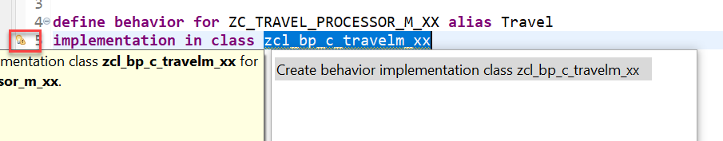


Click on create behavior implementation to create the class.

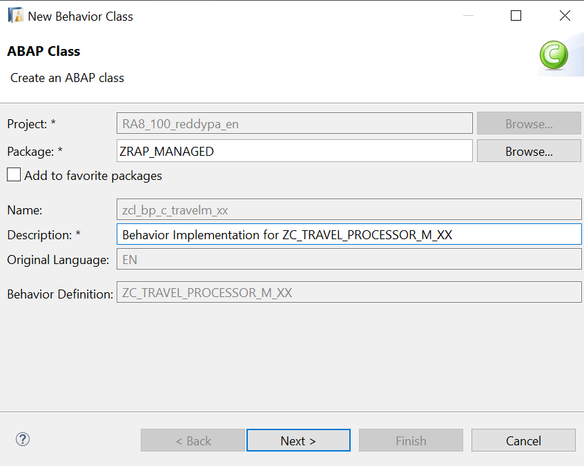

5.	In the method implementation paste the below code. where XX is your chosen suffix – of your business object.

```
  METHOD augment_create.
  
   DATA: travel_create TYPE TABLE FOR CREATE ZITC_AO_C_FE_TRAVEL.

    travel_create = CORRESPONDING #( entities ).
    LOOP AT travel_create ASSIGNING FIELD-SYMBOL(<travel>).
      <travel>-overallstatus  = 'O'.
      <travel>-%control-overallstatus = if_abap_behv=>mk-on.
    ENDLOOP.

    MODIFY AUGMENTING ENTITIES OF ZITC_AO_I_FE_TRAVEL ENTITY Travel CREATE FROM travel_create.
  ENDMETHOD.
  
  ```
  
6.	Save and Activate the Class.

7.	Test the app now using preview tool. On Click of `Create` AgencyID and Status are defaulted.

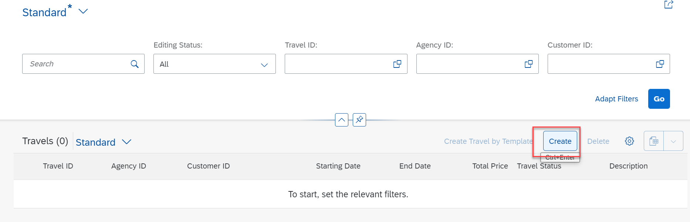

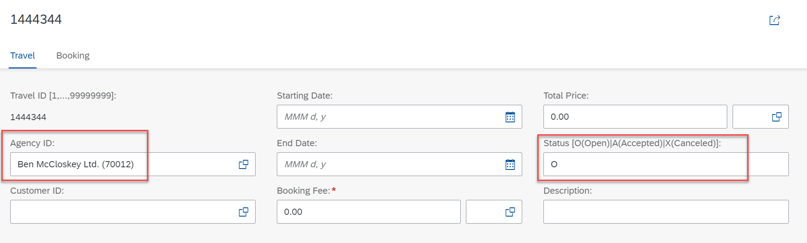

# Exercise 2 - Implementing the Action createTravelByTemplate

This action provides a template for creating a new travel based on an already existing travel instance.

Actions are specified as non-standard operations in behavior definitions by using the following syntax:

```
[implementation] managed;
define behavior for CDSEntity [alias AliasedEntityName]
implementation in class ABAP_ClASS_NAME [unique] 
...
{
 [static] [factory] [internal] action ActionName 
           [parameter {InputParameterEntity | $self)} ] 
           [result [cardinality] {OutputParameterEntity | $self}]; 
...      
}
```

1.	Make below changes to the behavior definition `ZITC_AO_I_FE_TRAVEL`, 
   - Change the class name in the first line to `zbp_itc_ao_i_fe_travel`
   - Add action `createTravelByTemplate` as defined below
   - Add behavior implementation class to the Booking behavior
         `implementation in class zcl_bp_booking_m_AO unique`
   - provide alias names for both travel and booking behavior as mentioned below
   - Add `field ( readonly ) travel_id;` to booking behavior

```
managed implementation in class zbp_itc_ao_i_fe_travel unique;

define behavior for ZITC_AO_I_FE_TRAVEL alias Travel
…
{
….
  factory action createTravelByTemplate [1];
…

}

```

2.	Click the activation button or use the shortcut `Ctrl + F3` to activate the behavior definition. 

3. Now behavior Implementation class should be created to implement action createTravelByTemplate. In your ABAP project (or ABAP Cloud Project), select the relevant behavior definition node ZITC_AO_I_FE_TRAVEL in Project Explorer.

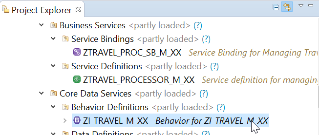

4.	Open the context menu and choose `New Behavior Implementation` to launch the creation wizard.

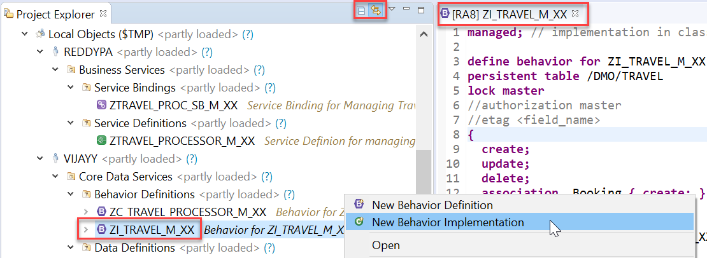

5.	Give behavior implementation name `zbp_itc_ao_i_fe_travel`(Replace AO with your Initials)  as below and click on Finish.

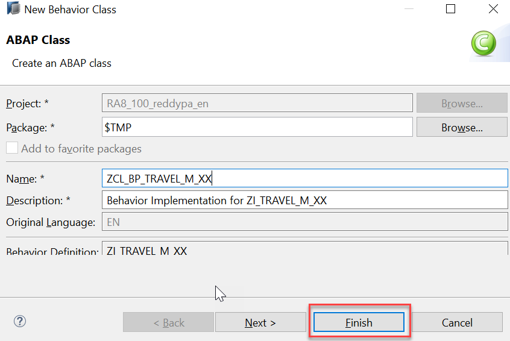

6.	Select the `Global class` section to see the generated code.

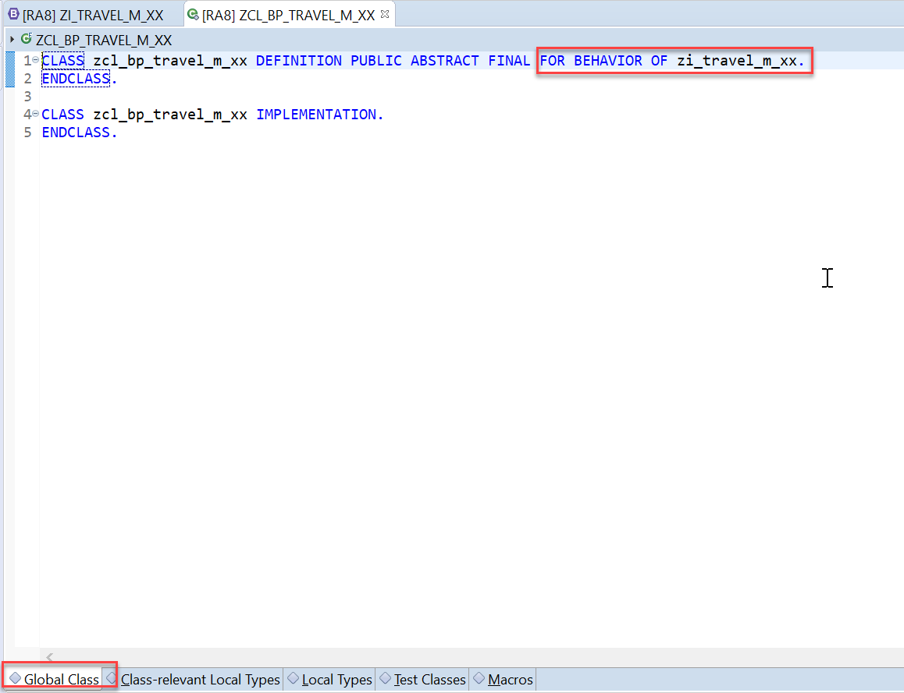

Compared to the standard ABAP class, the generated behavior pool (in our case `zbp_itc_ao_i_fe_travel`) provides you with an extension `FOR BEHAVIOR OF`.

The real substance of a behavior pool is in `Local Types` (there is currently no implementation yet). Here you can implement special local classes, namely handler classes for additional operations (such as actions), validations and determinations that are triggered at specific points in time within the interaction phase.

Note that these classes can be instantiated or invoked only by the ABAP runtime environment (virtual machine).

7.	Click the activation button or use the shortcut `Ctrl + F3` to activate the class.

8.	To Implement action `createTravelByTemplate` open behavior implementation class `zbp_itc_ao_i_fe_travel` `Local Types` as shown below and paste the below code.

```
CLASS lhc_travel DEFINITION INHERITING FROM cl_abap_behavior_handler.

  PRIVATE SECTION.

    METHODS createtravelbytemplate FOR MODIFY
      IMPORTING keys FOR ACTION travel~createtravelbytemplate.


ENDCLASS.

CLASS lhc_travel IMPLEMENTATION.

  METHOD createTravelByTemplate.
    SELECT MAX( travel_id ) FROM zitc_atrav INTO @DATA(lv_travel_id). "#EC CI_NOWHERE

    READ ENTITIES OF ZITC_AO_I_FE_TRAVEL IN LOCAL MODE
      ENTITY travel
         ALL FIELDS WITH CORRESPONDING #( keys )
         RESULT    DATA(lt_read_result)
         FAILED    failed
         REPORTED  reported.

    DATA(lv_today) = cl_abap_context_info=>get_system_date( ).

    DATA lt_create TYPE TABLE FOR CREATE ZITC_AO_I_FE_TRAVEL\\travel.

    lt_create = VALUE #( FOR row IN  lt_read_result INDEX INTO idx

                             ( %cid = row-TravelUUID
                               TravelUUID     = cl_uuid_factory=>create_system_uuid(  )->create_uuid_x16(  )
                               travelid      = lv_travel_id + idx
                               agencyid      = row-agencyid
                               customerid    = row-customerid
                               begindate     = lv_today
                               enddate       = lv_today + 30
                               bookingfee    = row-bookingfee
                               totalprice    = row-totalprice
                               currencycode  = row-currencycode
                               description    = 'Created by Anubhav'
                               OverallStatus = 'O' ) ). " Open


    MODIFY ENTITIES OF ZITC_AO_I_FE_TRAVEL IN LOCAL MODE
        ENTITY travel
           CREATE FIELDS (
                              TravelUUID
                              travelid
                              agencyid
                              customerid
                              begindate
                              enddate
                              bookingfee
                              totalprice
                              currencycode
                              description
                              OverallStatus )
           WITH lt_create
         MAPPED   mapped
         FAILED   DATA(failed_modify)
         REPORTED DATA(reported_modify).

    failed-travel   = CORRESPONDING #( BASE ( failed-travel )   failed_modify-travel   MAPPING TravelUUID = %cid ).
    reported-travel = CORRESPONDING #( BASE ( reported-travel ) reported_modify-travel MAPPING TravelUUID = %cid ).


*    READ ENTITIES OF ZITC_AO_I_FE_TRAVEL IN LOCAL MODE
*      ENTITY travel
*        ALL FIELDS WITH
*        CORRESPONDING #( mapped-travel )
*    RESULT DATA(lt_read_created).
*
*    mapped-travel = VALUE #( FOR key IN  mapped-travel  INDEX INTO idx
*                               ( %cid_ref = keys[ KEY entity %key = key-%cid ]-%cid_ref
*                                 %key     = key-%cid
*                                 %param-%tky   = key-%tky ) ) .
*
*    result = CORRESPONDING #( result FROM lt_read_created USING KEY entity  %key = %param-%key MAPPING %param = %data EXCEPT * ).


  ENDMETHOD.


ENDCLASS.
```

Replace AO with your initials.

9.	Click the activation button or use the shortcut `Ctrl + F3` to activate the behavior definition. 
10.	To enable action in UI, add action using below syntax in Travel Processor behavior Definition `ZITC_AO_C_FE_TRAVEL`.

```
projection;

define behavior for ZITC_AO_C_FE_TRAVEL //alias <alias_name>
{
….
use action createTravelByTemplate;
…
}
```

11.	Click the activation button or use the shortcut `Ctrl + F3` to activate the behavior definition.
12.	To enable action for UI consumption following UI annotation needs to be exposed to the consumer in Travel Processor Projection CDS View `ZITC_AO_C_FE_TRAVEL`.

```
@UI: {
          lineItem:       […..
                            { type: #FOR_ACTION, dataAction: 'createTravelByTemplate', label: 'Create Travel by Template' } ]
         …. }
```
This is already done in our case.

13.	Click the `preview` button by selecting the Entity type or double click the entity in the service binding to check how the UI of a Fiori application looks like or refresh the browser where Fiori app is displayed.


14.	The UI screen provides the button `Create Travel by Template` for the action as shown in the figure below.

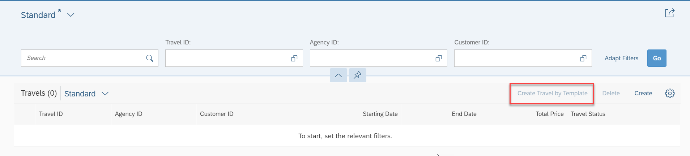

15.	Click on `Go` button and select any travel item and click on button `Create Travel by Template` button to copy the travel instance.

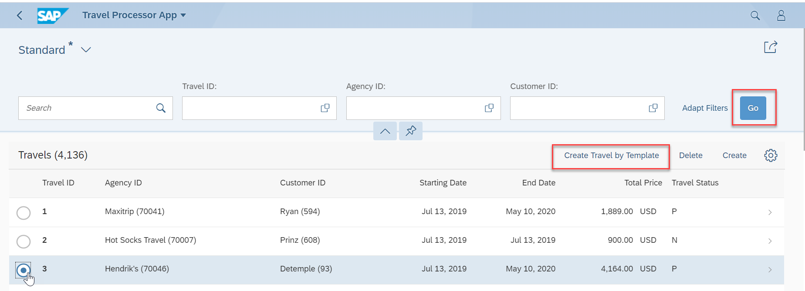

16.	In change mode (after the user clicks the `Edit` button on Fiori UI’s object page), the end user can change the relevant travel fields as shown in the figure below.

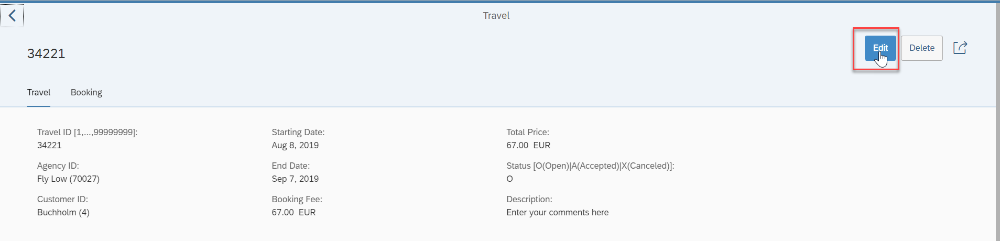

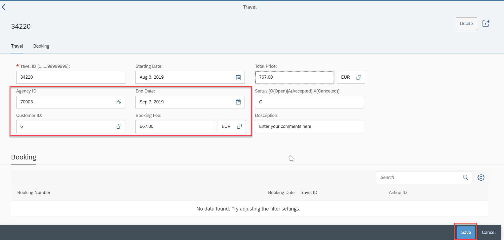

17.	As soon as the user chooses the `Save` button on the object page, the data is persisted in the corresponding database table and a travel instance with a new `Travel ID` is created.

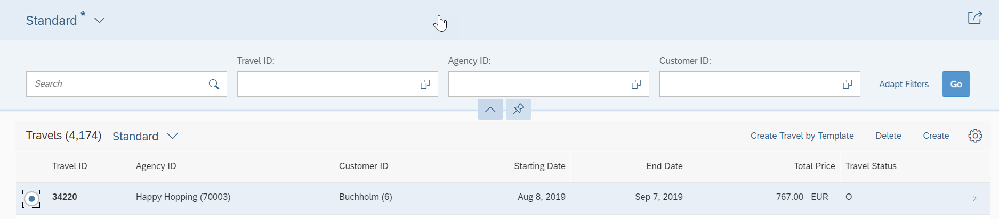


# Exercise 3 - Modeling Static and Dynamic Feature Control

As an application developer you may want to determine, which entities of your business object should be create-, delete- and update-enabled, so that they can be modified during consumption using EML or OData services. In addition, you also may want control which (UI) fields of an entity are read-only or which actions in which usage scenarios are enabled or disabled for execution by the end users.

In ABAP RESTful programming model, the feature control is precisely the means of accomplishing such tasks. It allows you to control the visibility and changeability of fields, operations or entire entities.

Depending on whether feature control refers to specific instances or is independent of each entity instance, we distinguish between `instance-bound` and `static feature control`.

The availability of feature control values is modelled in a behavior definition. Unlike static, instance-bound feature control requires not only a definition but also an implementation in a handler class of the behavior pool. Therefore, we also talk about `dynamic feature control` in case of instance-bound feature control.

Both, static and dynamic feature control is defined for different levels (entity, field, or action level) in the behavior definition by using the following syntax:

```
[implementation] managed;
define behavior for CDSEntity [alias AliasName]
implementation in class ABAP_ClASS [unique] 
...
{
/* (1) Feature control at entity level */
/* Static operation control*/
  internal create
  internal update
  internal delete

/* or (instance-based) dynamic operation control: implementation required! */
  create (features: instance);
  update (features: instance);
  delete (features: instance);

/* (2) Feature control at field level */
/* Static field control */
  field (read only | mandatory) f1[, f2, ..., fn];

/* or dynamic field control: implementation required! */
  field (features: instance) f1[, f2, ..., fn];

/* (3) Feature control for actions */
/* Static action control */
  internal action ActionName [...]

/* or dynamic action control: implementation required! */
  action ( features: instance ) ActionName [... ]      
}
```

1.	Add below feature control to Behavior Definition `ZITC_AO_I_FE_TRAVEL`. Also add `implementation in class zcl_bp_booking_m_AO unique` after define behavior for Booking `define behavior for ZITC_AO_C_FE_BOOKING alias booking`.
```
managed implementation in class zbp_itc_ao_i_fe_travel unique;

define behavior for ZITC_AO_I_FE_TRAVEL alias Travel
persistent table /DMO/TRAVEL
lock master
//authorization master ( instance )
//etag <field_name>
{
  ….
  
  // administrative fields: read only
  field ( readonly ) lastchangedat, lastchangedby, createdat, createdby;

  // mandatory fields that are required to create a travel
  field ( mandatory ) agencyid, OverallStatus, bookingfee, currencycode;

  // dynamic field control
  field (features : instance ) BookingFee;
  
…
  
}

For the travel entity, we define all admin fields as read-only, whereas the fields that are required for creating a travel instance are defined as mandatory.

The field `bookingFee` plays a special role and is intended for dynamic field control. In the corresponding implementation, we will not allow editing of the booking fee if agency code is 70041

```
CLASS lhc_travel DEFINITION INHERITING FROM cl_abap_behavior_handler.

….
  METHODS get_instance_features FOR INSTANCE FEATURES
        IMPORTING keys REQUEST requested_features FOR travel RESULT result.


…


ENDCLASS.

CLASS lhc_travel IMPLEMENTATION.


    ….
METHOD get_instance_features.

    READ ENTITIES OF ZITC_AO_I_FE_TRAVEL IN LOCAL MODE
        ENTITY Travel
        FIELDS ( AgencyID )
        WITH CORRESPONDING #( keys )
        RESULT DATA(lt_travel_result)
        FAILED failed.

        result = VALUE #( FOR ls_travel IN lt_travel_result
                           (         %tky                   = ls_travel-%tky
                             %field-BookingFee               = COND #( WHEN ls_travel-AgencyID = 70041
                                                                        THEN if_abap_behv=>fc-f-read_only
                                                                         ELSE if_abap_behv=>fc-f-unrestricted  )


                          ) ).

  ENDMETHOD.
…

ENDCLASS.

```

Replace AO with your initials 
```

2.	Click the activation button or use the shortcut `Ctrl + F3` to activate the behavior definition.

<a id="exercise-3"></a>

# Exercise 4 - Implementing the Determination

A determination is an implicitly executed function that handles side effects of modified entity instances. It is invoked by the business object’s framework as soon as a determination’s trigger condition at a predefined point in time, the determination time, is fulfilled.

Determinations are triggered internally based on changes made to the entity instance of a business object. The trigger conditions are checked by business object framework at different points during the transaction cycle, depending on the determination time and the changing operations on the relevant entity instances. For each determination, it is necessary to specify both the determination time and the changes that form the trigger condition. A trigger condition consists of a list of fields belonging to the same entity the determination is assigned to and the changing operations that include creating or updating entity instances. We call this operations trigger operations.

In case a field is changed (after creation or update), the condition is fulfilled. The framework evaluates the triggering condition of all determinations at certain points in time (determination time). For determinations, this is today either after each modification or during the save phase.

You can use a determination primarily to compute data that is derived from the values of other fields. The determined fields and the determining fields either belong to the same entity or to different entities of a business object.

As a result, determination can modify entity instances and return transition messages (error, warning, information, success).

Determinations are specified for individual business object’s entities in the behavior definition by using the following syntax:

```
[implementation] managed;
define behavior for CDSEntity [alias AliasedName]
implementation in class ABAP_ClASS [unique] 
...
{
  // (1) determination for triggers at field level 
  determination DeterminationName on (save | modify) { field f1[, f2, ..., fn] ; }

  // (2) determination for triggers at entity level 
  determination DeterminationName on (save | modify) { create; }
...      
}

```

1.	In the behavior definition `ZITC_AO_I_FE_TRAVEL`, the determination on the booking entity is defined as follows:

```
…
define behavior for ZITC_AO_C_FE_BOOKING alias booking
implementation in class zcl_bp_booking_m_AO unique
persistent table /dmo/booking
lock dependent ( travel_id = travel_id )
//authorization dependent( <local_field_name> = <target_field_name> )
//etag <field_name>
{
  
  …
  determination calculateTotalFlightPrice on modify { field flight_price, currency_code; create; }
…
}
```

The determination `calculateTotalFlightPrice` on the booking entity is intended to handle the calculation of total price of all flight bookings that belong to the selected travel. The determination will be triggered by on modify as determination time when creating new booking instances or updating the flight price value or when changing the currency. In other words: both fields `flight_price` and `currency_code` serve as trigger fields and form together with create and update operations the trigger condition for the determination.

2.	Click the activation button or use the shortcut `Ctrl + F3` to activate the behavior definition. 

3.	To Implement determination for booking open behavior implementation class `zcl_bp_booking_m_AO` `Local Types` as shown below and paste the below code.

```
CLASS lhc_booking DEFINITION INHERITING FROM cl_abap_behavior_handler.
  PRIVATE SECTION.

….
    METHODS calculate_total_flight_price FOR DETERMINATION booking~calculateTotalFlightPrice
      IMPORTING keys FOR booking.

ENDCLASS.

CLASS lhc_booking IMPLEMENTATION.


  ….

  METHOD calculate_total_flight_price.


 TYPES: BEGIN OF ty_amount_per_currencycode,
             amount        TYPE /dmo/total_price,
             currency_code TYPE /dmo/currency_code,
           END OF ty_amount_per_currencycode.

    DATA: amount_per_currencycode TYPE STANDARD TABLE OF ty_amount_per_currencycode.


    " Read all relevant travel instances.
    READ ENTITIES OF ZITC_AO_I_FE_TRAVEL IN LOCAL MODE
         ENTITY Travel
            FIELDS ( booking_fee currency_code )
            WITH CORRESPONDING #( keys )
         RESULT DATA(lt_travel).


    DELETE lt_travel WHERE currency_code IS INITIAL.

    LOOP AT lt_travel ASSIGNING FIELD-SYMBOL(<fs_travel>).
      " Set the start for the calculation by adding the booking fee.
      amount_per_currencycode = VALUE #( ( amount        = <fs_travel>-booking_fee
                                           currency_code = <fs_travel>-currency_code ) ).

      " Read all associated bookings and add them to the total price.
      READ ENTITIES OF ZITC_AO_I_FE_TRAVEL IN LOCAL MODE
        ENTITY Travel BY \_Booking
          FIELDS ( flight_price currency_code )
        WITH VALUE #( ( %tky = <fs_travel>-%tky ) )
        RESULT DATA(lt_booking).

      LOOP AT lt_booking INTO DATA(booking) WHERE currency_code IS NOT INITIAL.
        COLLECT VALUE ty_amount_per_currencycode( amount        = booking-flight_price
                                                  currency_code = booking-currency_code ) INTO amount_per_currencycode.
      ENDLOOP.


      CLEAR <fs_travel>-total_price.
      LOOP AT amount_per_currencycode INTO DATA(single_amount_per_currencycode).
        " If needed do a Currency Conversion
        IF single_amount_per_currencycode-currency_code = <fs_travel>-currency_code.
          <fs_travel>-total_price += single_amount_per_currencycode-amount.
        ELSE.
          TRY  .
              /dmo/cl_flight_amdp=>convert_currency(
                 EXPORTING
                   iv_amount                   =  single_amount_per_currencycode-amount
                   iv_currency_code_source     =  single_amount_per_currencycode-currency_code
                   iv_currency_code_target     =  <fs_travel>-currency_code
                   iv_exchange_rate_date       =  cl_abap_context_info=>get_system_date( )
                 IMPORTING
                   ev_amount                   = DATA(total_booking_price_per_curr)
                ).
            CATCH cx_amdp_execution_failed.

          ENDTRY.
          <fs_travel>-total_price += total_booking_price_per_curr.
        ENDIF.
      ENDLOOP.
    ENDLOOP.

    " write back the modified total_price of travels
    MODIFY ENTITIES OF ZITC_AO_I_FE_TRAVEL IN LOCAL MODE
      ENTITY travel
        UPDATE FIELDS ( total_price )
        WITH CORRESPONDING #( lt_travel ).

  ENDMETHOD.

..

ENDCLASS.

```

Replace AO with your initials.

4.	Click the activation button or use the shortcut `Ctrl + F3` to activate the behavior definition. 

5.	Click the `preview` button by selecting the Entity type or double click the entity in the service binding to check how the UI of a Fiori application looks like or refresh the browser where Fiori app is displayed.


6.	The figure below refers to the starting point of viewing with a newly created travel instance with the initial amount (Total Price) and the travel currency 0.00 EUR.

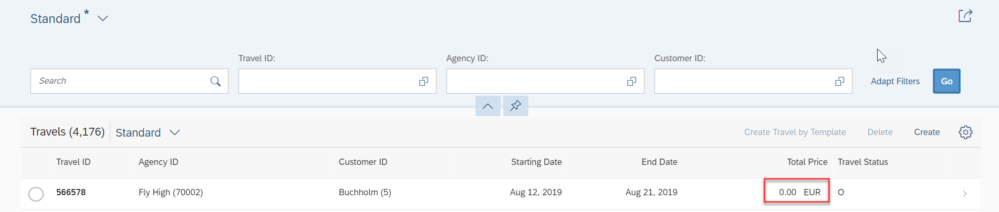

7.	If a user adds a flight booking to the travel, then also the travel’s `Total Price` is updated.

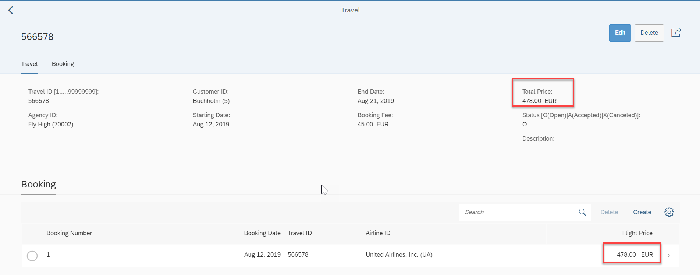.

8.	If the user switches the booking’s object page to `edit` mode and then changes the Flight Price, then the Total Price is also updated at root level.

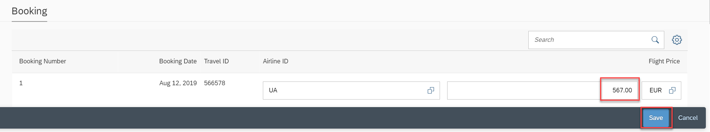

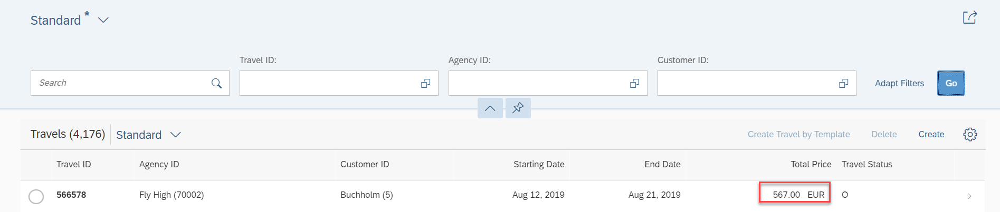

# Exercise 5 - Authorization

Introduction

Authorization control in RAP protects your business object against unauthorized access to data.
Authorization control is always relevant when the permission to execute an operation depends on the role of the business object consumer.
In RAP each read or modify request can be checked via authorization objects against user roles before the request is finally executed and reaches data. 

•	The authorization check with authorization objects is called from CDS entities in case of read requests.<br/>
•	And from the behavior implementation in case of modify requests.

Authorization Checks for Modify Operations:-<br/>
•	In RAP business objects, modifying operations, such as standard operations and actions can be checked against unauthorized access during runtime. <br/>
•	Authorization objects return authorization values, which you can use in the implementation to further process the request, in case of positive authorization results, or, to reject the modification request, in case of negative authorization results.

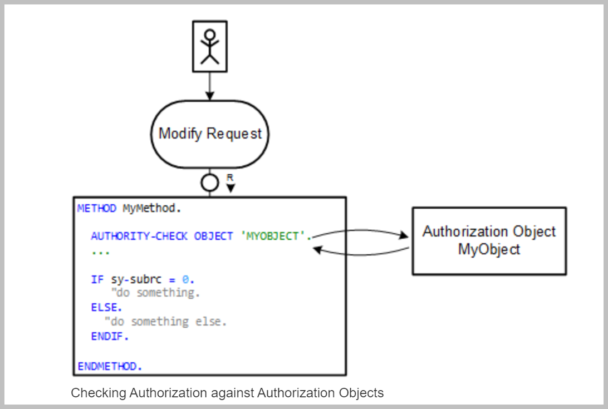

Global Authorization
•	Global authorization is used for all authorization checks that only depend on the user. <br/>
•	Global authorization checks can be implemented for both, static and instance-bound operations.

Instance Authorization
 
•	Instance authorization is used for all authorization checks that, in addition to the user role, depend on the state of the entity instance in question.Instance authorization is only possible for instance-based operations. <br/>
•	Operations that are excluded from instance authorization are CREATE and static actions. 

Authorization Definition
•	Authorization is defined in the behavior definition of a RAP business object.<br/>

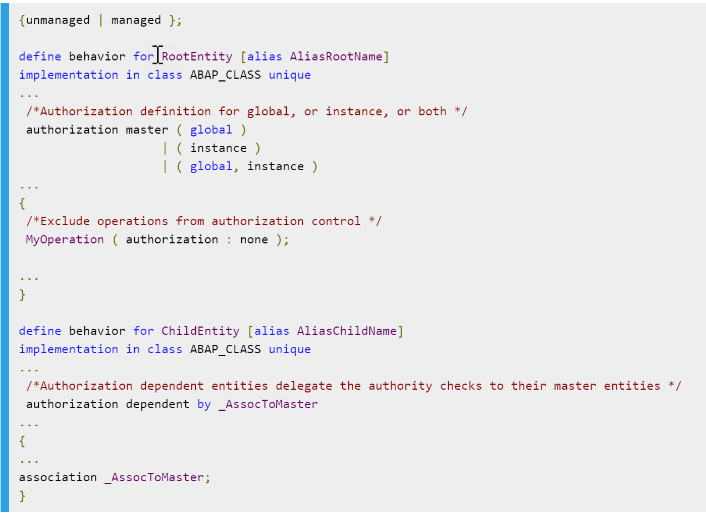

Authorization Master
•	An entity is defined as authorization master if the operations of this entity have their own authorization implementation. For the authorization master, you must define either global, or instance, or both.<br/>
•	The current version of the RAP model only supports authorization masters on root entities.<br/>
Authorization Dependent
•	An entity is defined as authorization dependent if the authorization control from the authorization master entity shall also be applied for the operations of this entity.

1. Change the Authorization check in the view `ZITC_AO_I_FE_TRAVEL`  from `#NOT_REQUIRED` to `#CHECK`

```
@AccessControl.authorizationCheck: #CHECK

```
2. In the Behavior defination Class `ZITC_AO_I_FE_TRAVEL` (Replace XX with your initials),add the below code to enable Authorization Control.
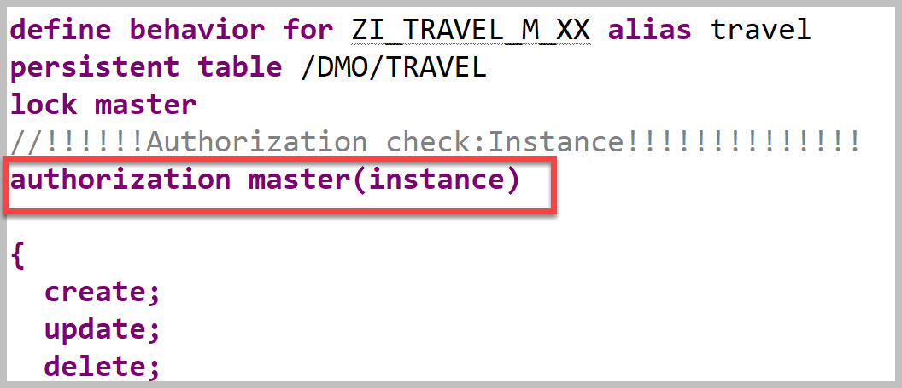
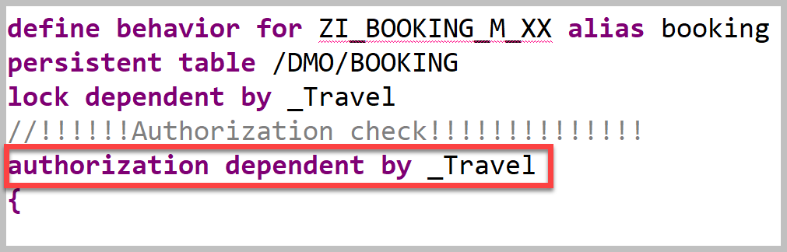
    
6.Add new method in Behavior Implementation Class to handle the Authorization Behavior.
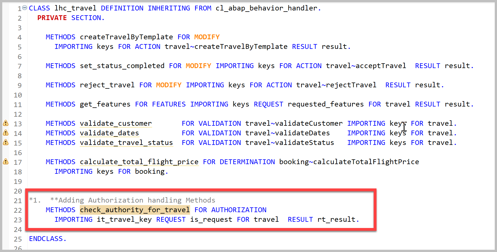


```
 **Adding Authorization handling Methods
    METHODS check_authority_for_travel FOR AUTHORIZATION
      IMPORTING it_travel_key REQUEST is_request FOR travel  RESULT rt_result.

```    
3.	Add below code in the method to handle Authorization
 ```
 *******************************************************************************
*
* Implements what operations and actions are (not) allowed for travel instances
*
*******************************************************************************
  METHOD check_authority_for_travel.

    DATA ls_result LIKE LINE OF rt_result.

    READ ENTITIES OF ZITC_AO_I_FE_TRAVEL IN LOCAL MODE
     ENTITY travel
      FIELDS ( travel_id customer_id status CountryCode )
        WITH VALUE #( FOR keyval IN it_travel_key ( %tky = keyval-%tky ) )
      RESULT DATA(lt_travel)
      FAILED DATA(ls_read_failed).

    LOOP AT lt_travel INTO DATA(ls_travel).

   DATA(lv_authorized) = abap_true.

*" For US/FR Country User do not have edit authorizations
      ls_result = VALUE #( travel_id   = ls_travel-travel_id
                           %update
                           = COND #( WHEN lv_authorized EQ abap_false
                                      THEN if_abap_behv=>auth-unauthorized ELSE if_abap_behv=>auth-allowed  ) ).

      APPEND ls_result TO rt_result.
    ENDLOOP.

  ENDMETHOD.
 ```
 4.	Expected Output:-Hiding and showing Edit Buttons
