**Previous Step**

[Home](https://github.wdf.sap.corp/DevelopmentLearning/restful-abap/wiki)

# Defining the Data Model with CDS
* [Introduction](#Int)
* [Exercise 1 - Creating a Data Definition for a CDS View](#exercise-1) 
* [Exercise 2 - Implementing the Travel CDS View as a Data Model](#exercise-2) 
* [Exercise 3 - Implementing the Agency CDS View as a Data Model](#exercise-3) 
* [Exercise 4 - Implementing the Customer CDS View as a Data Model](#exercise-4)
* [Exercise 5 - Implementing the Associations in Travel CDS View](#exercise-5)

<a id="Int"></a>
# Introduction
In this step you create the appropriate CDS views as the basis for the data model of our demo scenario. To do this, you create the appropriate data definitions as ABAP repository objects.
Entities involved in the present scenario and their relationships are:

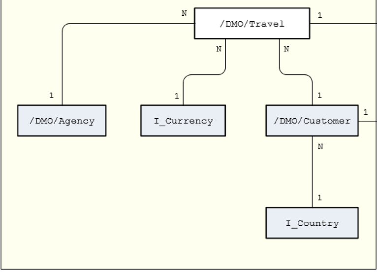

To define a data model based on the ABAP CDS view concept, you first need to create a data definition as the relevant ABAP Repository object using a wizard in ABAP Development Tools.

<a id="exercise-1"></a>
# Exercise 1 - Creating a Data Definition for a CDS View 
1.	Launch the ABAP Development Tools(ADT) or HANA Studio with ABAP Perspective

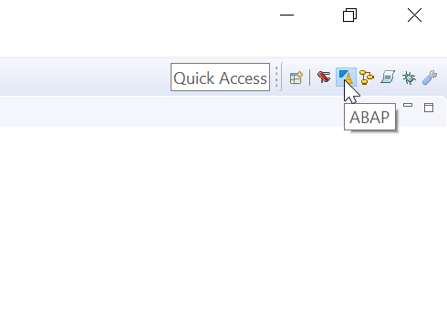

2. Connect to the RA8 system
* Open the context menu by right clicking in Project Explorer and choose `New->ABAP Project...`
* Select RA8 system (Make sure first to add RA8 in SAP Logon) and click `Next`
* Click `Next` to confirm the connection settings
* Give the following logon information 
  * Client: 100
  * User: user name will be given by the trainer
  * Password: password will be given by the trainer
* Click `Finish`

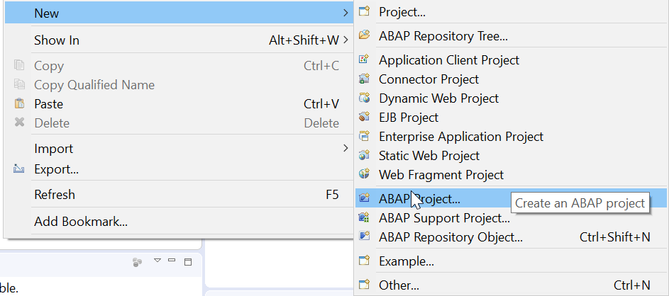

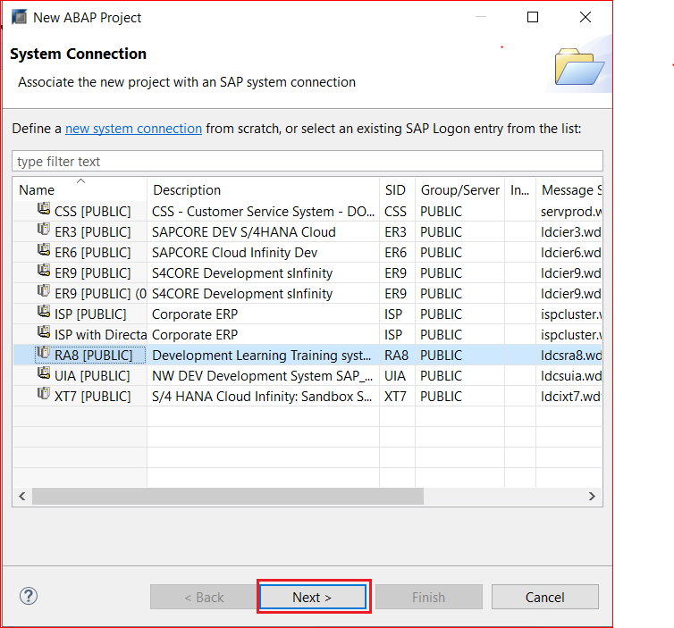

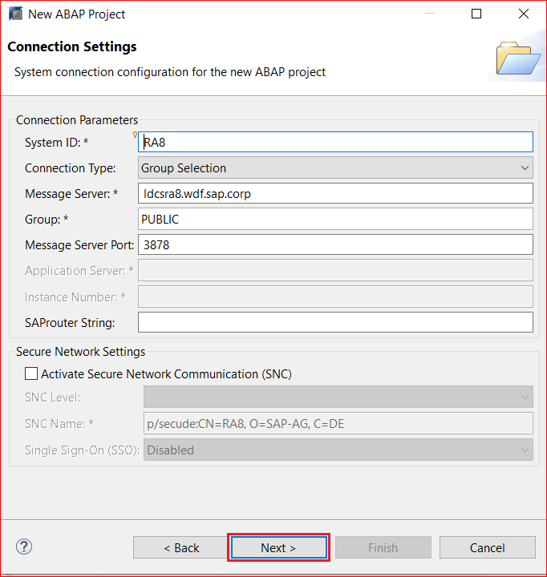

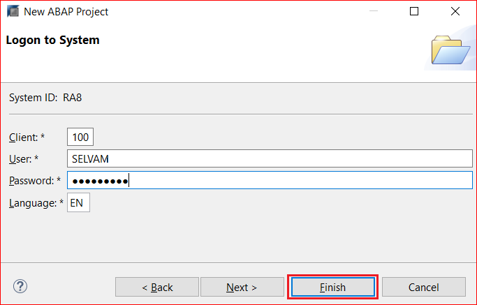

3.	Select `Local Objects ($TMP)`, Open the context menu by right clicking in Project Explorer and choose `New->Other ABAP Repository Object->Core Data Services->Data Definition` to launch the creation wizard for a data definition.

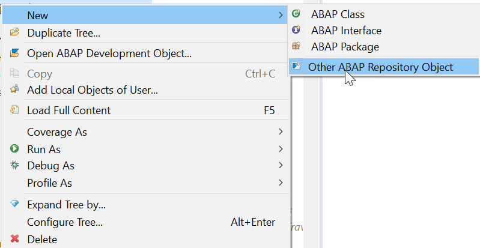

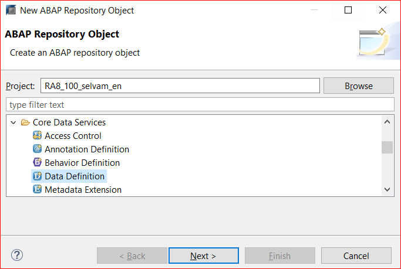

In addition to the Project and Package, enter the Name and a Description for the data definition you want to create. Give Package as **$TMP** if you are creating data definition in local objects.Click on Next button twice.

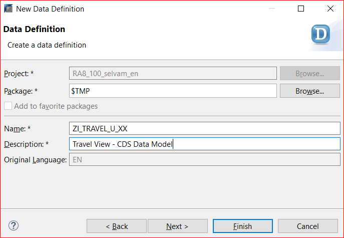

From the templates select the "define view entity" template and click on finish.
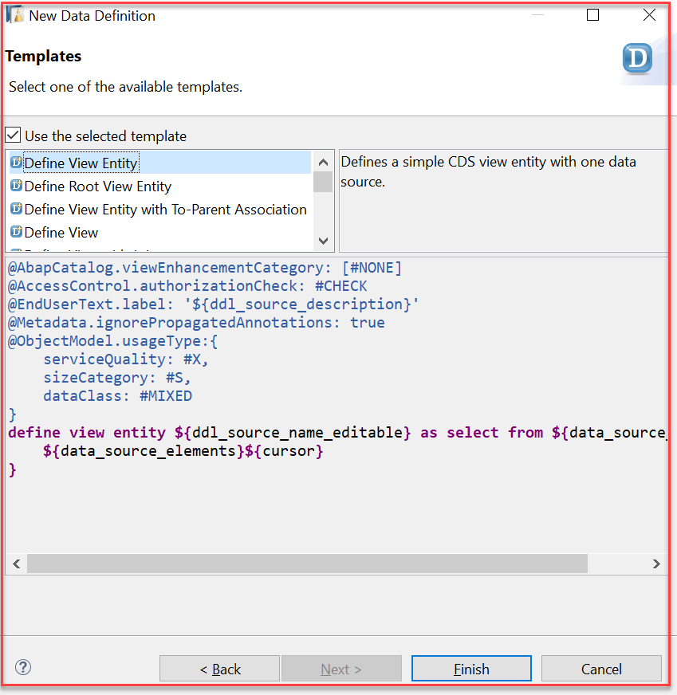

The generated source code already provides you with the necessary view annotations and adds placeholders for the names of the data source for query definition. 

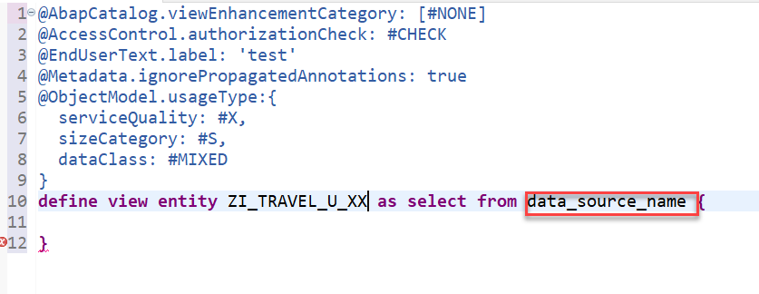

<a id="exercise-2"></a>
# Exercise 2 - Implementing the Travel CDS View as a Data Model

1.	Specify the names of the following:
      * Actual CDS view: **ZI_TRAVEL_U_XX**(Replace XX with your initials)
2.	In the SELECT statement, enter the predefined database table `/dmo/a_travel_d` as a data source and define an optional alias name `Travel` for the data source.
3.	Add the fields of `/dmo/a_travel_d` to the SELECT list (as they are required for new projection view) and assign alias names to each item field as follows:
```
key   Travel.travel_uuid     as TravelUUID,
      Travel.travel_id       as TravelID,
      Travel.agency_id       as AgencyID,
      Travel.customer_id     as CustomerID,
      Travel.begin_date      as BeginDate,
      Travel.end_date        as EndDate,
      Travel.booking_fee     as BookingFee,
      Travel.total_price     as TotalPrice,
      Travel.currency_code   as CurrencyCode,
      Travel.description     as Memo,
      Travel.overall_status  as Status 
      Travel.local_created_by         as CreatedBy,
      Travel.local_created_at         as CreatedAt,
      Travel.local_last_changed_by    as LastChangedBy,
      Travel.local_last_changed_at    as LastChangedAt,
```
Whenever you insert table fields or view elements in the SELECT list, you can make use of the content assist function in the data definition editor `(CTRL + SPACE)`.
To check the syntax before activation, click or use the shortcut `Ctrl + F2`.

4.	Define the relationship between amounts and unit of currency with the annotation `@Semantics.amount.currencyCode: 'CurrencyCode'` on CurrecyCode and reference the elements **TotalPrice**, **BookingFee**.
```
      @Semantics.amount.currencyCode: 'CurrencyCode'
      Travel.booking_fee   as BookingFee,
      @Semantics.amount.currencyCode: 'CurrencyCode'
      Travel.total_price   as TotalPrice,
      Travel.currency_code as CurrencyCode, 
```
In CDS, you can use semantic annotations to standardize semantics that have an impact on the consumer side for these elements. In general, elements that need to be marked as having semantic content to guarantee that they are handled correctly are elements that contain the following:
* Amounts of money -These elements need a reference to the currency related to this element.
* Amounts of measures - These elements need a reference to the unit of measure related to this element.
If you create annotations that define a link to the unit for the amounts, the amounts and their units are always handled as being dependent on each other in the OData service. On UIs amounts are displayed with the correct decimals regarding their unit.
5. Define the administrative fields with semantics annotations as below
```
      @Semantics.user.createdBy: true
      Travel.local_created_by                       as CreatedBy,
      @Semantics.systemDateTime.createdAt: true
      Travel.local_created_at                       as CreatedAt,
      @Semantics.user.lastChangedBy: true
      Travel.local_last_changed_by                  as LastChangedBy,
      @Semantics.systemDateTime.lastChangedAt: true
      Travel.local_last_changed_at                  as LastChangedAt,
```
6.	Click the activation button or use the shortcut `Ctrl + F3` to activate the data definition.
7.	Use Data preview tool see results of modeled CDS View, Open the context menu and choose `Open With->Data Preview` or use the shortcut `F8`.

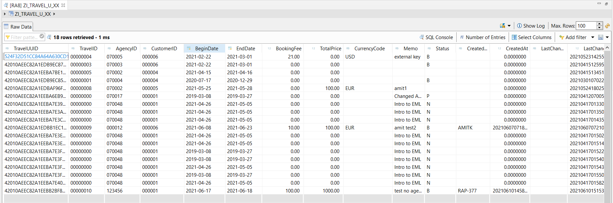

#### Solution 
Solution for this exercise can be found [here](/Unmanaged%20Implementation/DefiningDataModel/Soultions/Exercise-3.cds)

<a id="exercise-3"></a>
# Exercise 3 - Implementing the Agency CDS View as a Data Model
1.	Create Agency CDS view by following Steps in [Exercise-1](#exercise-1) or select Data Definition as shown below and right click to open context menu choose New Data Definition.

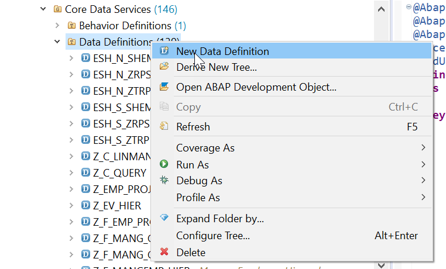

2.	Give Name and description as below:

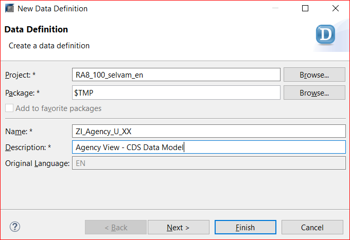

3.	Specify the names of the following:
     * Database view to be generated in the ABAP Dictionary: **ZAGENCY_UXX** (Replace XX with your initials)
     * Actual CDS view: **ZI_Agency_U_XX**(Replace XX with your initials)
4.	In the SELECT statement, enter the predefined database table `/dmo/agency` as a data source and define an optional alias name `Agency` for the data source.
5.	Add the fields of `/dmo/agency` to the SELECT list (as they are required for new projection view) and assign alias names to each item field as follows:

```
key   Agency.agency_id     as AgencyID,
      Agency.name          as Name,
      Agency.street        as Street,
      Agency.postal_code   as PostalCode,
      Agency.city          as City,
      Agency.country_code  as CountryCode,
      Agency.phone_number  as PhoneNumber,
      Agency.email_address as EmailAddress,
 	 Agency.web_address   as WebAddress
```
Whenever you insert table fields or view elements in the SELECT list, you can make use of the content assist function in the data definition editor `(CTRL + SPACE)`.
To check the syntax before activation, click or use the shortcut `Ctrl + F2`.

6.	Since the data of travel agency can vary from one country to another, the data model refers to the I_Country view using the association _Country. Add association to I_Country as to CDS View:

```
define view ZI_Agency_U_XX
  as select from /dmo/agency as Agency
  association [0..1] to I_Country as _Country on $projection.CountryCode = _Country.Country
{

  key Agency.agency_id     as AgencyID,
      Agency.name          as Name,
      Agency.street        as Street,
      Agency.postal_code   as PostalCode,
      Agency.city          as City,
      Agency.country_code  as CountryCode,
      Agency.phone_number  as PhoneNumber,
      Agency.email_address as EmailAddress,
      Agency.web_address   as WebAddress,
      _Country

}
```
`_Country` is exposed association here.

7.	Click the activation button or use the shortcut `Ctrl + F3` to activate the data definition.
8.	Use Data preview tool see results of modeled CDS View, Open the context menu and choose `Open With->Data Preview` or use the shortcut `F8`.

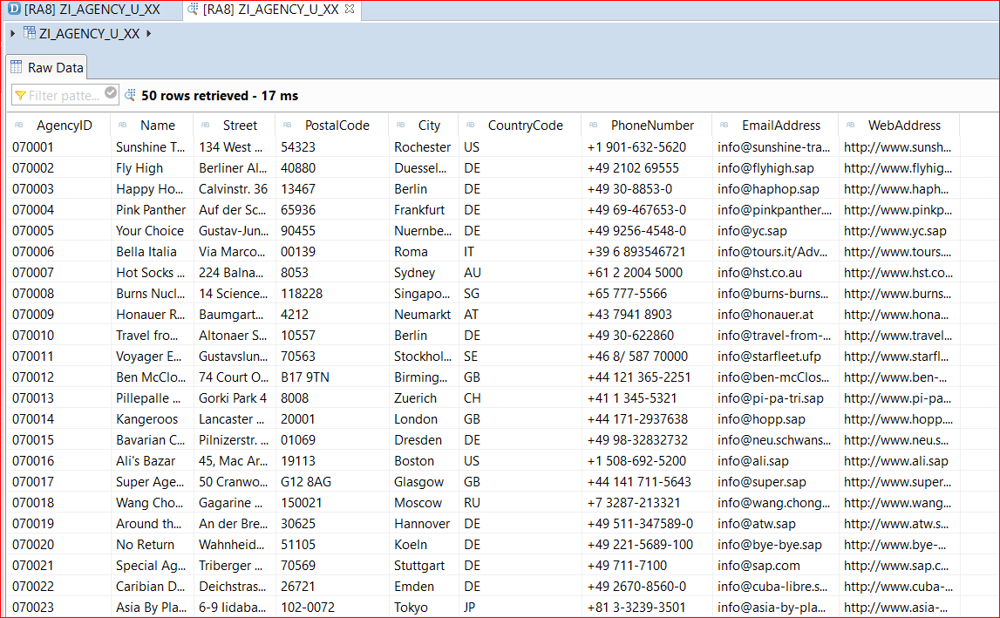

#### Solution 
Solution for this exercise can be found [here](/Unmanaged%20Implementation/DefiningDataModel/Soultions/Exercise-4.cds)

<a id="exercise-4"></a>
# Exercise 4 - Implementing the Customer CDS View as a Data Model
1.	Create Customer CDS view by following Steps in [Exercise-1](#exercise-1) or select Data Definition as shown below and right click to open context menu choose New Data Definition.


2.	Give Name and description as below:

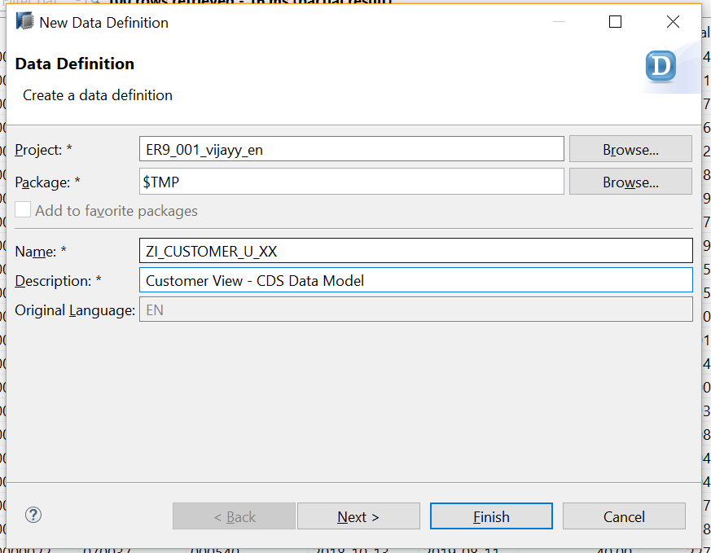

3.	Specify the names of the following:
     * Database view to be generated in the ABAP Dictionary: **ZCUSTOMER_UXX**(Replace XX with your initials)
     * Actual CDS view: **ZI_Customer_U_XX**(Replace XX with your initials)
 4.	In the SELECT statement, enter the predefined database table `/dmo/customer` as a data source and define an optional alias name `Customer` for the data source.
 5.	Add the fields of `/dmo/customer` to the SELECT list (as they are required for new projection view) and assign alias names to each item field as follows:
 ```
 key Customer.customer_id   as CustomerID,
      Customer.first_name    as FirstName,
      Customer.last_name     as LastName,
      Customer.title         as Title,
      Customer.street        as Street,
      Customer.postal_code   as PostalCode,
      Customer.city          as City,
      Customer.country_code  as CountryCode,
      Customer.phone_number  as PhoneNumber,
      Customer.email_address as EmailAddress
```
Whenever you insert table fields or view elements in the SELECT list, you can make use of the content assist function in the data definition editor `(CTRL + SPACE)`.
To check the syntax before activation, click or use the shortcut `Ctrl + F2`.

6.	A passenger’s data can vary from one country to another, the data model refers to the `I_Country` view using a corresponding association `_Country`. Add association to `I_Country`  for CDS View:
```
define view ZI_Customer_U_XX
  as select from /dmo/customer as Customer
  association [0..1] to I_Country as _Country on $projection.CountryCode = _Country.Country
{
  key Customer.customer_id   as CustomerID,
      Customer.first_name    as FirstName,
      Customer.last_name     as LastName,
      Customer.title         as Title,
      Customer.street        as Street,
      Customer.postal_code   as PostalCode,
      Customer.city          as City,
      Customer.country_code  as CountryCode,
      Customer.phone_number  as PhoneNumber,
      Customer.email_address as EmailAddress,
      _Country
}
```
`_Country` is exposed association here.

7.	Click the activation button or use the shortcut `Ctrl + F3` to activate the data definition.
8.	Use Data preview tool see results of modeled CDS View, Open the context menu and choose `Open With->Data Preview` or use the shortcut `F8`

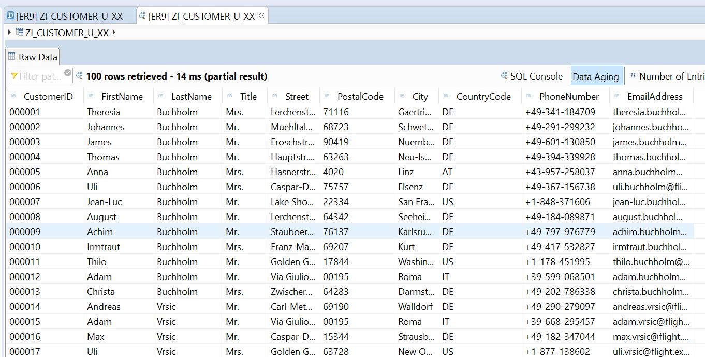

#### Solution 
Solution for this exercise can be found [here](/Unmanaged%20Implementation/DefiningDataModel/Soultions/Exercise-5.cds)

<a id="exercise-5"></a>
# Exercise 5 - Implementing the Associations in Travel CDS View 
1.	Open CDS View **ZI_TRAVEL_U_XX** (Replace XX with your initials), to open the CDS view you can use shortcut `Cltr + Shift + A` and give the CDS view name
2.	Give Agency, Customer, Currency association created in [Exercise-3](#exercise-3) and [Exercise-4](#exercise-4) to CDS view `ZI_TRAVEL_U_XX` (Replace XX with your initials) as follows:

```
define view entity ZI_TRAVEL_U_XX
  as select from /dmo/a_travel_d as Travel
  association [0..1] to  ZI_Agency_U_XX   as _Agency   on $projection.AgencyID = _Agency.AgencyID
  association [0..1] to ZI_Customer_U_XX as _Customer on $projection.CustomerID = _Customer.CustomerID
  association [0..1] to I_Currency       as _Currency on $projection.CurrencyCode = _Currency.Currency
{
  key Travel.travel_uuid   as TravelUUID,
      Travel.travel_id     as TravelID,
      Travel.agency_id     as AgencyID,
      Travel.customer_id   as CustomerID,
      Travel.begin_date    as BeginDate,
      Travel.end_date      as EndDate,
      @Semantics.amount.currencyCode: 'CurrencyCode'
      Travel.booking_fee   as BookingFee,
      @Semantics.amount.currencyCode: 'CurrencyCode'
      Travel.total_price   as TotalPrice,
      Travel.currency_code as CurrencyCode,
      Travel.description   as Memo,
      Travel.overall_status        as Status,

      /* Associations */
      _Agency,
      _Customer,
      _Currency
}
```
`_Agency`, `_Customer` and `_Currency` are exposed associations

3.	Click the activation button or use the shortcut `Ctrl + F3` to activate the data definition.

**Next Steps**

[Creating an OData Service](/Unmanaged%20Implementation/CreatingODataService/README.md)

