**Previous Step**

[Creating an OData Service](/Unmanaged%20Implementation/CreatingODataService/README.md)

# Developing Read-Only List Reporting Apps
* [Exercise 1 - Designing the User Interface for a Fiori Elements App – UI Annotations](#exercise-1)
* [Exercise 2 – Object Page UI Annotations](#exercise-2) 
* [Exercise 3 - Providing Value Help for the Selection Fields](#exercise-3) 
* [Exercise 4 - Displaying Text for Unreadable Elements](#exercise-4) 
* [Exercise 5 - Adding Search Capabilities](#exercise-5)
* [Exercise 6 - Changing UI Field Labels and Descriptions](#exercise-6)


<a id="exercise-1"></a>
# Exercise 1 - Designing the User Interface for a Fiori Elements App – UI Annotations
UI annotations can be used in CDS to configure the look of the user interface of a Fiori App.
To define annotations that concern the UI we use CDS annotations. CDS offers the option of defining a universal setup for the presentation and order of items in the CDS layer. This is independent of the UI technology or application device, which benefits the reuse of one OData service for multiple applications. The application developer does not have to configure the setting for every application, but can reuse the settings that were defined in the back end.

You have created an OData service and published it locally. The UI can now be set up with UI annotations in the CDS layer to define a UI layout independent from the application or the user device. You can always check the influence of UI annotations by using the preview function in the service binding artifact.

Using the following annotations in the below steps, you specify which of the elements appear in the list report when starting the app. In addition to their order, you can also rename them if you want to display them with a name other than the name specified in the CDS entity. The columns that are shown in the UI are then predefined and you can retrieve data by choosing GO without determining the columns to be displayed.

1.	Open the CDS view for which you want to determine the list report. In our case: **ZI_TRAVEL_U_XX** (Replace XX with your initials).
Use `Ctrl + Shift + A` shortcut key and give **ZI_TRAVEL_U_XX** (Replace XX with your initials) in search criteria and click on OK to open the CDS View
2.  Create new Metadata extension for the CDS view **ZI_TRAVEL_U_XX** . Right click on the cds view from project explorer and select New Metadata Extension.
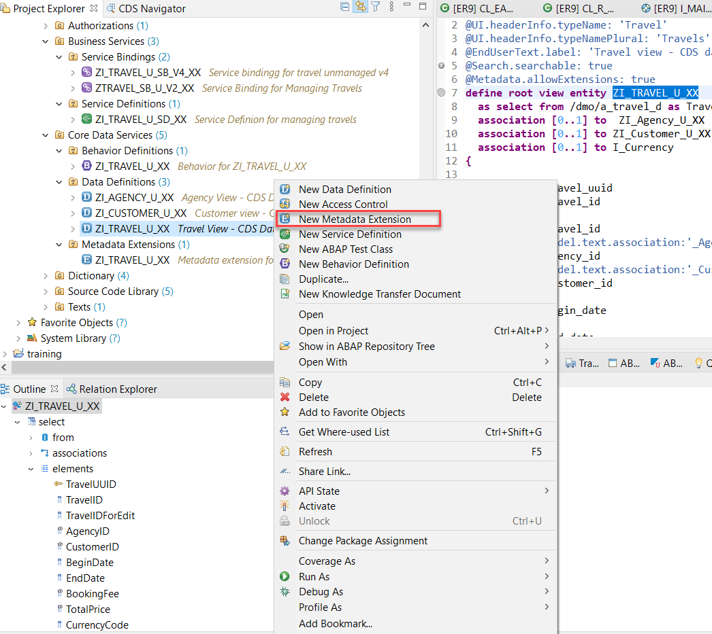	
3. In the dialog give a name and description for the extension like belox (Replace XX with your initials).
	
4. Add annotations mentioned in further steps in the metadata extension file.
5.	For the headline of the list, use the annotation `@UI.headerInfo.typeNamePlural:'name'`.
    For Sorting the list by any filed in descending order add the annotation `presentationVariant: [{ sortOrder: [{ by: 'fieldname', direction: #DESC }] }] ` 
These annotations are entity annotations because it concerns the whole entity rather than a specific element

```
@Metadata.layer: #CORE
@EndUserText.label: 'Travel view - CDS data model'
@UI: { headerInfo: {
                     typeNamePlural: 'Travels',
                      },
       presentationVariant: [{ sortOrder: [{ by: 'TravelID', direction: #DESC }] }] 
      }
annotate view ZI_TRAVEL_U_XX
  with 
```

6.	Specify a position for each element that you want to show in the list report with the annotation `@UI.lineItem: [ { position:decfloat } ]`.
The value's decfloat number does not represent an absolute measure and works as a relative value to the positions of the other elements instead. Hence, the elements are arranged in ascending order with regard to the annotation value.

```

  @UI: { lineItem:       [ { position: 10, importance: #HIGH }
                         ] }
  TravelID;

  @UI: { lineItem:       [ { position: 20,
                             importance: #HIGH } ] }
  AgencyID;

  @UI: { lineItem:       [ { position: 30,
                             importance: #HIGH } ] }

  CustomerID;

  @UI: { lineItem:       [ { position: 40,
                              importance: #MEDIUM } ] }
  BeginDate;

  @UI: { lineItem:       [ { position: 41,
                             importance: #MEDIUM } ]
         }
  EndDate;

  @UI: { lineItem:       [ { position: 45,
                             importance: #MEDIUM } ],
        }
  Memo;

  @UI: { lineItem:       [ { position: 50, importance: #HIGH } ] ,
          }
  Status;
  
```

7.	You can display the elements with a name other than the name specified in CDS by labeling them with the annotation `@UI.lineItem.label: label`. In particaular, you can label element with names containing spaces. The label is displayed in the column header of the list report.

```

  @UI: { lineItem:       [ { 
                            position: 10, 
                            importance: #HIGH ,
                            label: 'Travel ID'}
                         ]}
 
  TravelID;

  @UI: { lineItem:       [ { position: 20,
                             importance: #HIGH,
                             label: 'Agency ID' } ] }
 
  AgencyID;

  @UI: { lineItem:       [ { position: 30,
                             importance: #HIGH,
                             label: 'Customer Number' } ] }

  CustomerID;

  @UI: { lineItem:       [ { position: 40,
                              importance: #MEDIUM,
                              label: 'Start Date' } ] }
  BeginDate;

  @UI: { lineItem:       [ { position: 41,
                             importance: #MEDIUM,
                             label: 'End Date' } ] }
  EndDate;

  @UI: { lineItem:       [ { position: 50, importance: #HIGH , label: 'Travel Status'} ]  }
  Status;
 ```
 
8.	Click the activation button or use the shortcut `Ctrl + F3` to activate the data definition.
9.	Right click on the Entity type or double click the entity in the service binding to check how the UI of a Fiori application looks like or refresh the browser where Fiori app is displayed.

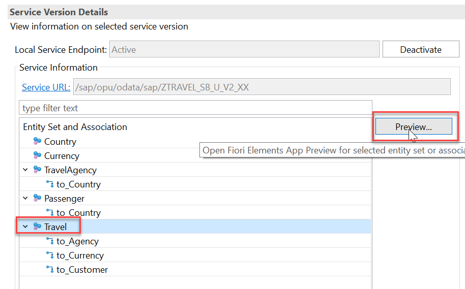

10. Default browser will be opened with Travel Fiori app.
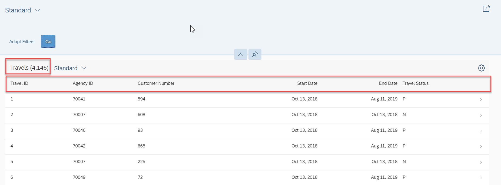

11.  You can define a header for the list report or you can implement selection fields on top of the list report to filter for a specific item. One selection field always refers to one element, but you can have more than one selection field in a single list report header. To include selection fields for the key elements in the header, use the annotation `@UI.selectionField.position:decfloat` on the respective elements.

```
      @UI.selectionField: [ { position: 10 } ]
      TravelID;
      @UI.selectionField: [ { position: 20 } ]
      AgencyID;
      @UI.selectionField: [ { position: 30 } ]
       CustomerID;
```

12.  Repeat 5, 6, 7 steps to see the selection fields in the output as below:

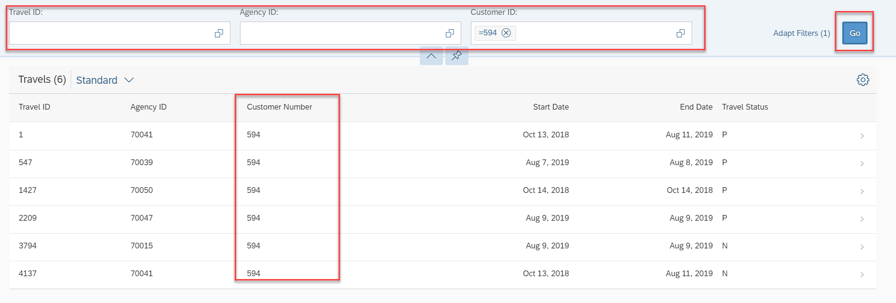

#### Solution
Solution for this excercise can be found [here](/Unmanaged%20Implementation/DevelopingReadOnlyListReport/Solutions/Excercise1.cds)

<a id="exercise-2"></a>
# Exercise 2 – Object Page UI Annotations

The list report gives a general overview of the list items, the object page shows more detailed information about a single list item. You navigate to the object page by clicking the item in the list report.

1.	Specify the title of the object page. The title that is displayed in the middle of the header is defined as an entity annotation in the MetaDeta Extension  **ZI_TRAVEL_U_XX** (Replace XX with your initials) using the annotation `@UI.headerInfo.typeName: 'name'`.

```
@UI: { headerInfo: { typeName: 'Travel',
                     typeNamePlural: 'Travels - UnManaged',
                      },
       presentationVariant: [{ sortOrder: [{ by: 'TravelID', direction: #DESC }] }] }
annotate view ZI_TRAVEL_U_XX
  with 
```
2.	Create a standard facet for the object page with the annotation `@UI.facet.purpose: #STANDARD`. This annotation must be in the element section. A facet is a type of section in the object page. It can contain diagrams or other information in a discrete part of the user interface.
  
```  
   @UI.facet: [ { id:            'Travel',
                 purpose:       #STANDARD,         
                 }
             ]
  TravelID;
```

3.	Specify the type of the facet. In our case, the object page displays the detailed information of one list item. Use the annotation `@UI.facet.type: #IDENTIFICATION_REFERENCE`

```
   @UI.facet: [ { id:            'Travel',
                 purpose:       #STANDARD,
                 type:          #IDENTIFICATION_REFERENCE               
                  }
             ]
  TravelID;
```
4.	Specify a name for the object page facet header. Use the annotation `@UI.facet.label: 'name'`.To define the position of the facet, use the annotation `@UI.facet.position: decfloat`.
```
   @UI.facet: [ { id:            'Travel',
                 purpose:       #STANDARD,
                 type:          #IDENTIFICATION_REFERENCE,
                 label:         'Travel',
                 position:      10 }
             ]
  TravelID;
```

An object page of a type identification reference is created. You can now define the elements that are displayed in the object page

5.	Specify the position and the label for each element that you want to show in the object page. Use the annotations `@UI.identification.position: 'decfloat'` and `@UI.identification.label: 'name'` on each element.
```

  @UI: { identification: [ { position: 10 }
                         ] }

  TravelID;

  @UI: { identification: [ { position: 20 } ]}

  AgencyID;

  @UI: { identification: [ { position: 30 } ] }
  CustomerID;

  @UI: {identification: [ { position: 40 } ] }
  BeginDate;

  @UI: { identification: [ { position: 41 } ] }
  EndDate;

  @UI: { identification: [ { position: 42 } ] }
  BookingFee;

  @UI: { identification: [ { position: 43 } ] }
  TotalPrice;

  @UI: { identification: [ { position: 45,
                            label: 'Comment' } ] }
  Memo;

  @UI: { identification: [ { position: 50, label: 'Status' } ] }
  Status;
```

6.	Click the activation button or use the shortcut `Ctrl + F3` to activate the data definition.
7.	Right click on the Entity type or double click the entity in the service binding to check how the UI of a Fiori application looks like or refresh the browser where Fiori app is displayed.


8.	Press the GO button to retrieve data.
9.	The following image displays the object page after clicking the Travel item 1.

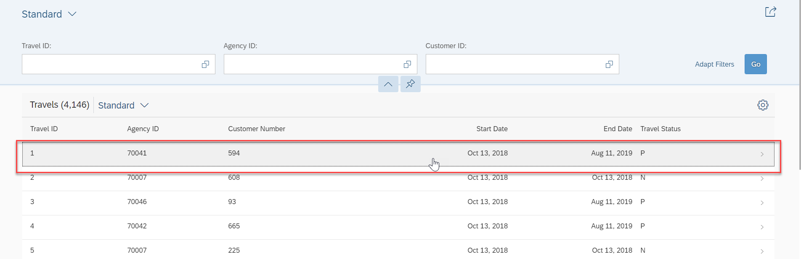

Click on any row

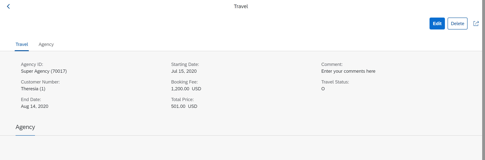

#### Solution
Solution for this excercise can be found [here](/Unmanaged%20Implementation/DevelopingReadOnlyListReport/Solutions/Excercise2.cds)

<a id="exercise-3"></a>
# Exercise 3 – Providing Value Help for the Selection Fields
Use value helps to make it easier to find the correct value for selection fields on the UI. 
We created some selection fields for the UI to enable the end user to find a suitable agency and customer in the travel app. The difficulty, however, is to know the correct agency and customer. You can enable a value help option to assist the end user in finding correct values.
The end user then gets direct access to a value help dialog in which he or she can enter values.
1.	To provide a value help for the selection fields of the elements Agency ID and Customer ID in the CDS view **ZI_TRAVEL_U_XX** (Replace XX with your initials), use the `annotation @Consumption.valueHelpDefinition`.

Open the CDS view **ZI_TRAVEL_U_XX** (Replace XX with your initials). Use `Ctrl + Shift + A` shortcut key and give **ZI_TRAVEL_U_XX** (Replace XX with your initials) in search criteria and click on OK to open the CDS View

2.	Annotate the elements `AgencyID` and `CustomerID`. You want to equip these elements with a value help dialog with the annotation.

```
  @Consumption.valueHelpDefinition: [{ entity: { name: '/DMO/I_Agency', element: 'AgencyID' } }]
  AgencyID;

  @Consumption.valueHelpDefinition: [{ entity: { name: '/DMO/I_Customer', element: 'CustomerID'  } }]
  CustomerID;
```

In our case, the target view is **ZI_AGENCY_U_XX** (Replace XX with your initials) with the target element `AgencyID` and for **'ZI_CUSTOMER_U_XX'** (Replace XX with your initials) with target element `CustomerID`

For the value help, you do not need to establish an association between the source and the target view. Nevertheless, you need to make sure that the target view is part of the service.

If not already done, add the value help provider view to the service definition.

3.	Click the activation button or use the shortcut `Ctrl + F3` to activate the data definition.
4.	Right click on the Entity type or double click the entity in the service binding to check how the UI of a Fiori application looks like or refresh the browser where Fiori app is displayed.


5.	Default browser will be opened with Travel Fiori app.

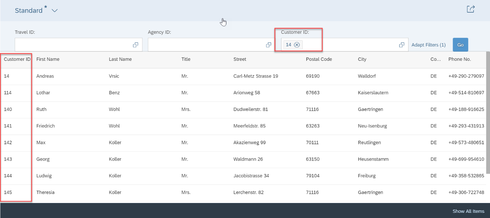

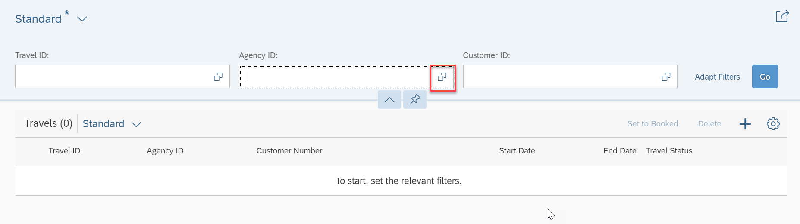

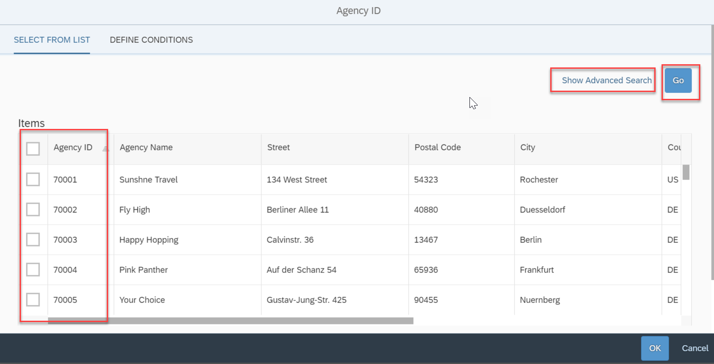


<a id="exercise-4"></a>
# Exercise 4 - Displaying Text for Unreadable Elements

Use text associations to add readable texts to short forms or identifiers.

Data that is stored in databases is usually kept as short as possible and consequently, many words are shortened or abbreviated with a character code. While this is convenient for storage reasons, it becomes a problem on the UI as the elements might then not be understandable anymore.

The readable names of the agency and customer can be displayed in the UI together with `AgencyID` and `CustomerID` codes. The text is taken from the text provider view **ZI_Agency_U_XX** (Replace XX with your initials)  and **ZI_Customer_U_XX** (Replace XX with your initials). We want to display the text for the agency and customer on the list report page and on the object page. Therefore, we need to implement the text association for views **ZI_TRAVEL_U_XX** (Replace XX with your initials). Apart from an association with the text provider view, the text element in that view needs to be specified as text with an `@Semantics` annotation. In addition, the element with the agency and customer code in the source view must be annotated to assign the text from the associated view to the element.

1.	Open the CDS view **ZI_Agency_U_XX** (Replace XX with your initials). Use the annotation `@Semantics.text: true` on the element Name to identify the annotated element as a text and activate the view.
```
….
define view ZI_Agency_U_XX
  as select from /dmo/agency as Agency
  association [0..1] to I_Country as _Country on $projection.CountryCode = _Country.Country
{

  key Agency.agency_id     as AgencyID,
      @Semantics.text: true
      Agency.name          as Name,
….
}
```
2.	Open the CDS view **ZI_Customer_U_XX** (Replace XX with your initials). Use the annotation `@Semantics.text: true` on the element Name to identify the annotated element as a text and activate the view.

```
…..
define view ZI_Customer_U_XX
  as select from /dmo/customer as Customer
  association [0..1] to I_Country as _Country on $projection.CountryCode = _Country.Country
{
  key Customer.customer_id   as CustomerID,
      @Semantics.text: true
      Customer.first_name    as FirstName,
…
}
```
In general, you can annotate more than one view field as a text field. However, only the first annotated field is respected in the text consumer view for OData exposure.

3.	CDS view **ZI_TRAVEL_U_XX** (Replace XX with your initials), for which you want to display the text. Implement an association to the CDS view **ZI_Agency_U_XX** (Replace XX with your initials) with the join condition on `AgencyID`. This association serves as a text association. In our case association is already done.
```
…..
define view entity ZI_TRAVEL_U_XX
  as select from /dmo/a_travel_d as Travel
  association [0..1] to ZI_Agency_U_XX   as _Agency   on $projection.AgencyID = _Agency.AgencyID
{
…..
}
```
4.	CDS view **ZI_TRAVEL_U_XX** (Replace XX with your initials), for which you want to display the text. Implement an association to the CDS view **ZI_Customer_U_XX** (Replace XX with your initials) with the join condition on `CustomerID`. This association serves as a text association. In our case association is already done.

```
….
define view entity ZI_TRAVEL_U_XX
  as select from /dmo/a_travel_d as Travel
  ….
  association [0..1] to ZI_Customer_U_XX as _Customer on $projection.CustomerID = _Customer.CustomerID
{
}
```

5.	Use the annotation `@ObjectModel.text.association: '<_AssocToTextProvider>'` on the element  `AgencyID` , `CustomerID` and reference the association `_Agency`, `_Customer` as a text association. Then activate the CDS view.

```
….
define view entity ZI_TRAVEL_U_XX
  as select from /dmo/a_travel_d as Travel
  association [0..1] to ZI_Agency_U_XX   as _Agency   on $projection.AgencyID = _Agency.AgencyID
  association [0..1] to ZI_Customer_U_XX as _Customer on $projection.CustomerID = _Customer.CustomerID
  …..
{
….
      @ObjectModel.text.association:'_Agency'
      Travel.agency_id     as AgencyID,
 …..
      @ObjectModel.text.association:'_Customer'
      Travel.customer_id   as CustomerID,

      
      /* Associations */
      _Agency,
      _Customer,
…
}
```

6.	Click the activation button or use the shortcut `Ctrl + F3` to activate the data definition.
7.	Right click on the Entity type or double click the entity in the service binding to check how the UI of a Fiori application looks like or refresh the browser where Fiori app is displayed.


8.	Press the GO button to retrieve data.
9.	Now `AgencyID` and `CustomerID` are clearly identified by their names
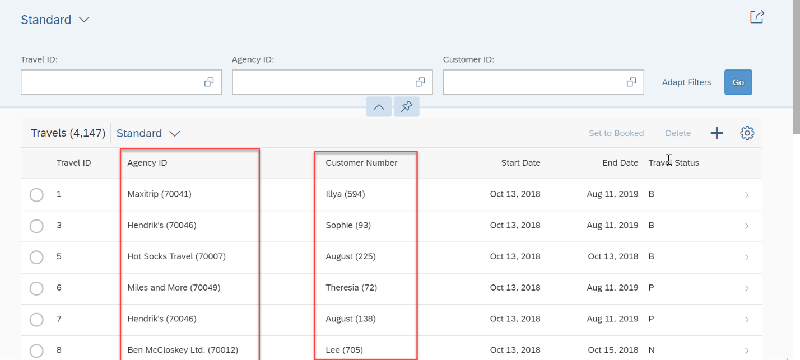

#### Solutions
Solution for this exercise can be found [here](/Unmanaged%20Implementation/DevelopingReadOnlyListReport/Solutions/Exercise4.cds)


<a id="exercise-5"></a>
# Exercise 5 - Adding Search Capabilities

Include a search input field to execute a text and fuzzy search on multiple elements.
You use annotations to enable search capabilities for a specific CDS view and to mark the elements that you want to be included in the search scope. You can also define fuzziness thresholds for the search, so that entries are also found if the values are entered in the search field with incorrect spelling. This makes the search easier and more effective.

1.	Enable the relevant elements for searches in **ZI_TRAVEL_U_XX** (Replace XX with your initials).
•	Open the Metadata Extension **ZI_TRAVEL_U_XX**(Replace XX with your initials).
•	Use the annotation `@Search.searchable: true` on the entity level to enable the entity for searches and to expose a standard search field on the UI.
If you use this annotation in a CDS view, you must assign at least one default search element.

```
@Search.searchable: true
annotate view ZI_TRAVEL_U_XX
  with 
…
```

2.	Choose the elements that you want to search for and annotate them with `@Search.defaultSearchElement: true`.

3.	Define a fuzziness threshold for the searchable elements with `@Search.fuzzinessThreshold: <fuzziness_value>`.

You can set a fuzziness threshold of 0 to 1. SAP recommends that you use 0.7 to begin with. This means that every item with a 70% match and greater is found. You can then customize the threshold.

For the use cases mentioned above, you want to be able to search for `TravelID`, `AgencyID`, and `CustomerID` in the travel view. 

```
{
…
    @Search.defaultSearchElement: true
	@Search.fuzzinessThreshold: 0.7
  TravelID;

….

      @Search.defaultSearchElement: true
	@Search.fuzzinessThreshold: 0.7
     AgencyID;
….
      @Search.defaultSearchElement: true
	@Search.fuzzinessThreshold: 0.7
      CustomerID;
…
}
```


4.	Annotate the association `_Agency` with `@Search.defaultSearchElement: true` to enable the search for elements in the associated view.
```
{
….
  @Search.defaultSearchElement: true
      _Agency,
….
}
```
5.Click the activation button or use the shortcut `Ctrl + F3` to activate the data definition.
6.Right click on the Entity type or double click the entity in the service binding to check how the UI of a Fiori application looks like or refresh the browser where Fiori app is displayed.


7.Browser will be opened with Travel Fiori app.
Now the end user can search for travel by specific agency. The following figure illustrates the agency search 70041 (Maxitrip).
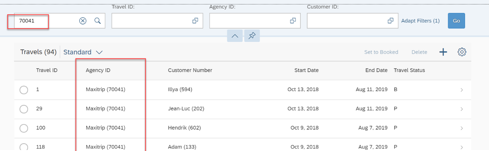

8. For our use case, we not only want to search for elements in the main view of the app, but also for the fields of the associated view. Enable the relevant elements for search in **ZI_Agency_U_XX** (Replace XX with your intials). As previously described, open the CDS view **ZI_Agency_U_XX**(Replace XX with your intials), mark it as search enabled, and then choose the elements to search on with a proper fuzziness threshold.

```
@AbapCatalog.sqlViewName: 'ZAGENCY_UXX'
@AbapCatalog.compiler.compareFilter: true
@AbapCatalog.preserveKey: true
@AccessControl.authorizationCheck: #CHECK
@EndUserText.label: 'Agency view - CDS data model'
@Search.searchable: true
define view ZI_Agency_U_XX
  as select from /dmo/agency as Agency
  association [0..1] to I_Country as _Country on $projection.CountryCode = _Country.Country
{

  …
      @Search.defaultSearchElement: true
      @Search.fuzzinessThreshold: 0.7
      Agency.city          as City,
      @Search.defaultSearchElement: true
      @Search.fuzzinessThreshold: 0.7
Agency.country_code  as CountryCode,
      
…
}
```
The association is now search enabled. This means it is possible to search for travel with a specific countrycode and at a specific city at the same time, even though the elements are not part of the same view. 

9.Repeat steps 5,6 and 7 to open the Fiori App.
The following figure displays the search results for travel located at countrycode DE.
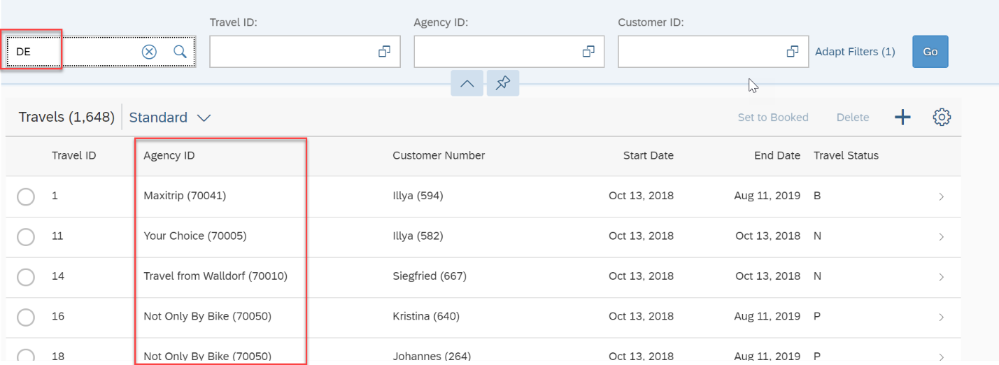

The following figure displays the search result of travel located at countrycode DE and city Berlin.


#### Solutions
Solution for this exercise can be found [here](/Unmanaged%20Implementation/DevelopingReadOnlyListReport/Solutions/Excercise5)

<a id="exercise-6"></a>
# Exercise 6 - Changing UI Field Labels and Descriptions

Field labels and description help to customize the UI of the app.
Meaningful descriptions of elements that appear on the user interface are a key concept for working with an app and improving the user experience. It is essential that all items on the UI are readable and understandable for the end user.
Although every data element in ABAP Dictionary is labeled with descriptions for presentation on the UI, sometimes you want to modify the description for a specific use case and give it a name other than the name predefined on the persistent database layer.
In the CDS layer, database description labels can be redefined and given more information by using the annotations `@EndUserText.label: '<text>'` and `@EndUserText.quickInfo: '<text>'`.
The labels that are assigned in the CDS layer overwrite the database field descriptions and are exposed to the OData service. These labels are also propagated to the UI and displayed on the user interface if no UI labeling annotations exist that overwrite the CDS EndUserText annotations.
UI labeling annotations, such as `@UI.lineItem: [ { label: '' } ]`, overwrite any `@EndUserText` labeling annotations on the UI. However, they are not manifested in the OData service metadata.
A tooltip can provide additional or more thorough information for the element. The tooltip is displayed on the UI as mouse over text. If no `@EndUserText` annotations are used, the text for the mouse over function is retrieved from the long description of the data element stored in ABAP Dictionary.
In general, every text that is used in EndUserText annotations is translated into every relevant language by the SAP translation process, along with the labels that are given to the data elements.
1.	In the Metadata Extension **ZI_TRAVEL_U_XX** (Replace XX with your initials), we defined two selection fields that are labeled differently than the corresponding list item. We use the `@EndUserText` annotation to acquire matching labels.

```
{
…
      
      @EndUserText.label: 'Agency ID'
      AgencyID;
      
      @EndUserText.label: 'Customer Number'
      CustomerID;
…
}
```

2.	Click the activation button or use the shortcut `Ctrl + F3` to activate the data definition.
3.	Right click on the Entity type or double click the entity in the service binding to check how the UI of a Fiori application looks like or refresh the browser where Fiori app is displayed.


4.	Press the GO button to retrieve data.
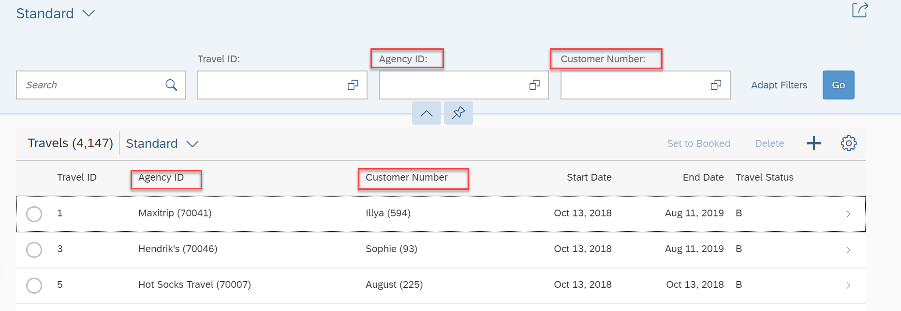

In our travel scenario, we have equipped the CDS elements with UI annotations to display them adequately in the UI, which means that all elements are already represented with a meaningful label.

However, there is one use case where EndUserText labels are necessary to ensure coherence on the UI. Whereas `@UI.listItem` and `@UI.identification` offer the option to directly label list items and object page items with UI annotations, the `@UI.selectionField` annotation lacks this option. The selection field label is therefore retrieved from the database label and might not match the label we have given to the list item and the identification. In this case, it is useful to apply the `@EndUserText` annotations to those elements that represent selection fields to provide consistency.

5.	If you want additional and longer information about an element, you can use the annotation `@EndUserText.quickInfo: <text>` to display a text when hovering over the element.

```
      @EndUserText.quickInfo: 'Travel Identification for Customer.'
      TravelID;
```
6.	Repeat 2, 3 and 4 steps to open Travel app
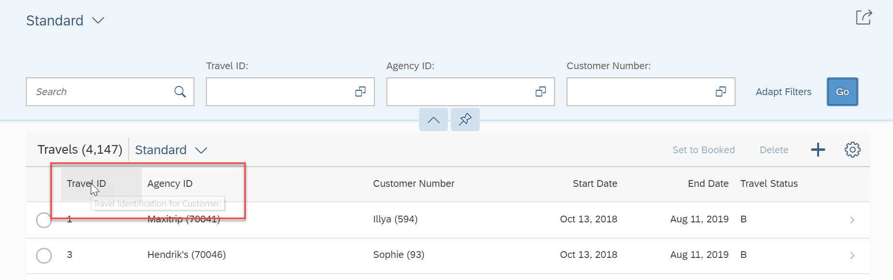

If you do not define a tooltip in CDS, the mouse over text displays the short description of the data element in ABAP Dictionary.


#### Solutions
Solution for this exercise can be found [here](/Unmanaged%20Implementation/DevelopingReadOnlyListReport/Solutions/Exercise6.cds)

**Next Steps**

[Developing Unmanaged Transactional Apps](/Unmanaged%20Implementation/DevelopingUnmanagedTransactionalApp/README.md)


