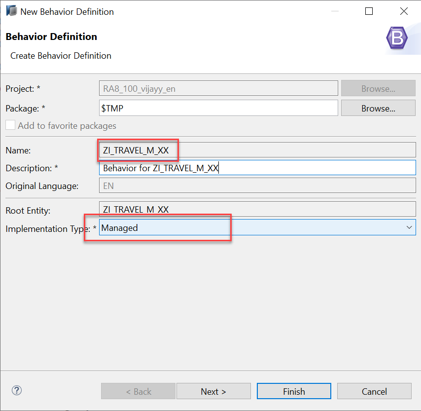

# Developing Transactional App Based on Managed Scenario

* [Anubhav Trainings Official Website](https://www.anubhavtrainings.com)
* [Anubhav Trainings Official Channel](https://www.youtube.com/@AnubhavOberoy)

<a id="introduction"></a>
# Introduction 
In this module, we will limit our focus to modeling an elementary behavior in which only the standard operations `create()`, `update()`, and `delete()` are defined for each entity. These operations, along with some basic properties (behavior characteristics), should already be enough to obtain a ready-to-run business object.
<a id="exercise-2"></a>
# Exercise 1 - Defining Behavior definition for Travel Interface View (BDEF Interface)
1.	In the Project Explorer view of your ABAP project (or ABAP Cloud Project), select the node for the data definition that defines the root entity **ZITC_AO_C_FE_TRAVEL**.


2.	Open the context menu and choose **New Behavior Definition** to launch the behavior definition creation wizard.


3.	Select Implementation Type as **Managed** as shown below and click on Finish.



4.	Behavior definition for Travel and Booking Business Objects gets created as shown below:

```
managed; // implementation in class zbp_itc_ao_i_fe_travel unique;

define behavior for ZITC_AO_C_FE_TRAVEL alias Travel
persistent table zitc_atrav
lock master
total etag Lastchangedat
authorization master ( instance )
etag master LastChangedAt
{
  create;
  update;
  delete;
  field ( numbering : managed, readonly ) TravelUUID;
  association _Booking { create; }

  mapping for zitc_atrav
    {
      TravelID      = travel_id;
      AgencyID      = agency_id;
      CustomerID    = customer_id;
      BeginDate     = begin_date;
      EndDate       = end_date;
      BookingFee    = booking_fee;
      TotalPrice    = total_price;
      CurrencyCode  = currency_code;
      Description   = description;
      OverallStatus = overall_status;
    }
}
```

```
define behavior for ZITC_AO_I_FE_Booking alias Booking
persistent table zitc_abook
lock dependent by _Travel
authorization dependent by _Travel
etag master LastChangedAt
{
    field ( numbering : managed, readonly ) BookingUUID;
    field ( readonly ) TravelUUID;
    update;
    delete;
    association _Travel;

    mapping for zitc_abook
        {
        BookingID    = booking_id;
        BookingDate  = booking_date;
        CustomerID   = customer_id;
        CarrierID    = carrier_id;
        ConnectionID = connection_id;
        FlightDate   = flight_date;
        FlightPrice  = flight_price;
        CurrencyCode = currency_code;
        }
}
```
**Travel Behavior Definition:** 

•	The source code of the behavior definition consists of a header information and two definitions for entity behavior: one for the root travel entity and one for the child entities booking– corresponding to the composition tree of the business object.

•	Note that for each entity of the composition tree, the transactional behavior can be defined in the behavior definition at most once.

•	All required transactional operations of an individual business object’s node are specified in the same behavior definition (that is introduced by the keyword `DEFINE BEHAVIOR FOR ...` ).

•	The header specifies managed implementation type of our business object’s provider since we are going to implement all essential parts of an application from scratch.

•	For this implementation type, all required standard operations (create, update, delete) and create by association must only be specified in the behavior definition to obtain a ready-to-run business object.

•	Our **TRAVEL** business object refers to the underlying CDS data model, which is represented by root entity `ZITC_AO_C_FE_TRAVEL`. All data changes related to this entity that result from transactional behavior are stored in the database table zitc_atrav.

•	The transactional handling of the business object's root entity travel is mainly determined by the standard operations create, update, and delete. The fact that in our scenario new instances of the booking child entity should also be created for a specific travel instance is considered by the addition of the _Booking association. The keyword `{create;}` declares that this association is create-enabled what exactly means that instances of the associated bookings can only be created by a travel instance.

**Booking Behavior Definition:** 

•	The sub node of TRAVEL business object structure refers to the corresponding data model for bookings that is represented by the child entity ZI_BOOKING_M_XX.

•	The transactional handling of child entity - booking is determined by the standard operation update and delete.

•	All data changes related to booking entity that result from transactional behavior are stored in the database table `zitc_abook`.

5.	Uncomment `lock master`

```
…
lock master
…
```

Uncommenting this will enable lock on your Transactional behavior, once you enable this line and then we will later check once our application is ready.

6. Uncomment `etag master <field_name>` and replace `<field_name>` with `lastchangedat` in the root behavior.

```
etag master lastchangedat

```

7.	Uncomment `persistent table <???>` and add table name `zitc_abook`
```
….
persistent table zitc_abook
….
```
All data changes related to booking entity that result from transactional behavior are stored in the database table `zitc_abook`.

8.	Uncomment `lock dependent by <association>` and replace `<association>` with `_Travel`

```
…
lock dependent by _Travel
….
```

9.Uncomment `etag master <field_name>` and replace `<field_name>` with `lastchangedat` in the booking behavior.

```
etag master lastchangedat

```

10.	Click the activation button or use the shortcut `Ctrl + F3` to activate the behavior definition.

#### Solution 
Solution for this exercise can be found [here](/Managed%20Implementation/DevelopingTransactionalAppM/solutions/readme.md)

<a id="exercise-3"></a>
# Syntax for Defining Managed Transactional Behavior

To define the transactional behavior for a CDS Entity for managed implementation type, the following syntax is used:

```
/* Header of behavior definition */
[implementation] managed;

/* Definition of entity behavior */
define behavior for CDSEntity [alias AliasName]

/* Entity properties */
[implementation in class ABAP_CLASS_NAME [unique] ]
persistent table DB_TABLE_NAME
[etag {master Field | dependent by _Association}]
lock {master Field [unmanaged] | dependent by _Association}
[authorization {master(instance)|dependent by _Association}] 


{
/* Static field control */
  [field (read only | mandatory) field1[, field2, ..., fieldn];]
/* Dynamic field control */
  [field (features: instance) field1[, field2, ..., fieldn];]
/* Managed Early Numbering */
  field ( [readonly,] numbering:managed ) keyfield1[, keyfield2, ..., keyfieldn];]; 

/* Mapping entity's field types with table field types */
   mapping for DB_TABLE_NAME corresponding;

/* Standard operations */
  [internal] create;                  
  [internal] update;
  [internal] delete;

/* Actions */ 
  action ActionName;  

/* Associations */ 
  [association AssociationName [abbreviation AbbreviationName] {[create;] } ]

/* Validations */
   // (1) validations for triggers at field level 
      validation ValidationName on save { field f1, f2, ..., fn; } 

   // (2) validations for triggers at operation level
      validation ValidationName on save { create; update; delete; }

   // (3) combined trigger usage
      validation ValidationName on save { create; field f1; }

/* Determinations */
  // (1) determination for triggers at field level 
     determination DeterminationName on (save | modify) { field f1, f2, ..., fn; }

  // (2) determination for triggers at operation level 
     determination DeterminationName on (save | modify) { create; update; delete; }

  // (3) combined trigger usage
     determination DeterminationName on (save | modify) { create; field f1; }

}
```
