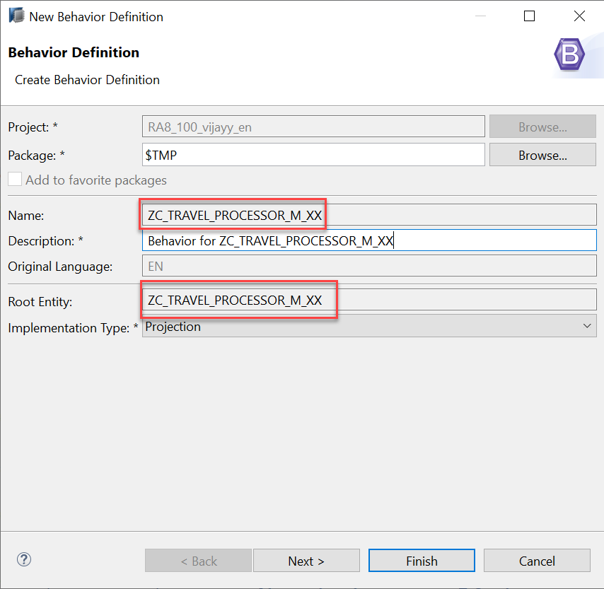

# Developing Transactional App Based on Managed Scenario

* [Anubhav Trainings Official Website](https://www.anubhavtrainings.com)
* [Anubhav Trainings Official Channel](https://www.youtube.com/@AnubhavOberoy)

# Exercise - Defining Behavior definition for the Travel Processor BO Projection (BDEF Projection)

The behavior for the BO projection is defined in a behavior definition of type projection. The type is defined in the behavior definition header. The projection behavior definition provides the behavior for the projection CDS view. All characteristics and operations that you want to include in the BO projection must be listed explicitly. The keyword for this is use.

Syntax: Behavior Definition for Projection

```
projection; 

 define behavior for ProjectionView alias ProjectionViewAlias 
  /* use the same eTag defined in underlying behavior definititon */
  use etag 
 {
  /* define static field control */ 
  field ( readonly ) ProjViewElem1;
  field ( mandatory ) ProjViewElem2;

  /* expose standard operations defined in underlying behavior definition */
  use create; 
  use update;
  use delete;

  /* expose actions or functions defined in underlying behavior definition */
  use action|function ActionName [as ProjAction] [external ExtProjname];

  /* expose create_by_association for child entities defined in underlying behavior definition */
  use association _Assoc { create; }
} 
```

1.	To create a projection behavior definition is to use the context menu in the project explorer by selecting the relevant projection root view **ZC_TRAVEL_PROCESSOR_M_XX** and choosing New Behavior Definition.

 
 
2.	Wizard for Create behavior definition opens, the behavior definition always uses the same name as the corresponding root view.  click on **Finish** button.
 


3.	When creating the behavior definition based on the projection view, the template automatically creates the type projection and lists all available characteristics and operations of the underlying behavior definition. That means, if nothing is done explicitly the BO projection has the same behavior as the underlying BO.

```
projection;
strict ( 2 );
use draft;

define behavior for ZITC_AO_C_FE_TRAVEL alias Travel
{
  use create;
  use update;
  use delete;

  use association _Booking { create;  }
}

define behavior for ZITC_AO_C_FE_BOOKING alias Booking
{
  use update;
  use delete;

  use association _Travel;
}
```

4.	Click the activation button or use the shortcut `Ctrl + F3` to activate the behavior definition.
