# Developing Transactional App Based on Managed Scenario

* [Anubhav Trainings Official Website](https://www.anubhavtrainings.com)
* [Anubhav Trainings Official Channel](https://www.youtube.com/@AnubhavOberoy)

# Enabling the Draft Handling for semantic key based scenario 

* [Exercise 1 - Enable the draft handling in the base business object]
* [Exercise 2 - Enable the draft handling in the projected business object]

<a id="exercise-1"></a>
# Exercise 1 - Enable the draft handling in the base business object

You will now enable the draft handling for the managed based business object (BO) with a few additions in the behavior definition.

1.	Open the base behavior definition **ZITC_AO_I_FE_TRAVEL** where **AO** is your chosen suffix – of your business object.
You can also use the shortcut `Ctrl+Shift+A` to open ABAP development object.
 
 

2.	Add the addition **with draft;** after the **managed;** keyword in the header section to enable draft handling for your business object.

```with draft;```

 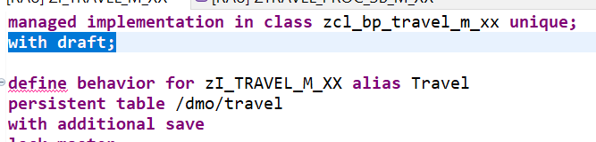

3.	Specify the draft table for the travel entity, where the draft travel data will be persisted as show on the screenshot.

**Note: Draft tables are fully managed by the RAP framework at runtime**

For this, insert the code snippet provided below as shown on the screenshot. 

Do not forget to replace the placeholder **AO** with your chosen suffix.


`draft table zdtravel_AO`

 

4.	Do the same for the booking entity – i.e. define the draft table where the draft booking data will be persisted.

For this, insert the code snippet provided below in the booking behavior definition as shown on the screenshot.

Do not forget to replace the placeholder **AO** with your chosen suffix.


`draft table zdbook_AO`

 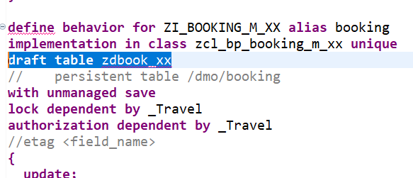

5.	Now, you will create the draft table **zdtravel_AO** where **AO** is your chosen suffix, to store the draft data for the travel entity.

The ADT `Quick Fix` feature can be used to generate the draft table.

For this, set the cursor on the table name, and press **Ctrl+1** to star the `Quick Fix` dialog.

 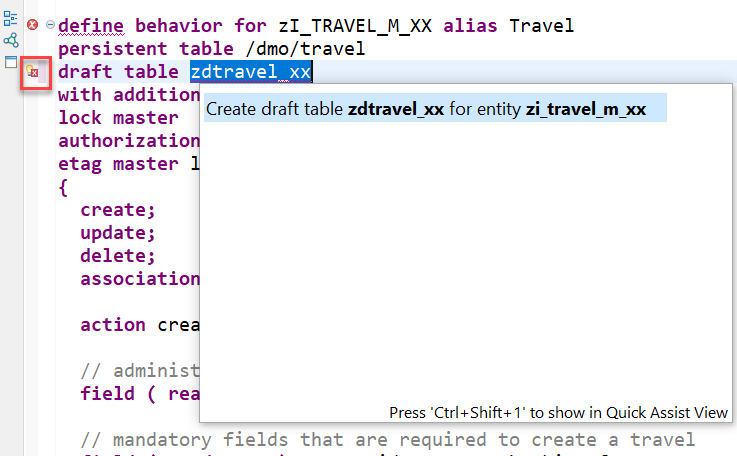

6.	Leave the defaulted values as they are in the appearing dialog and choose **Next**. 


 
7.	Choose **Finish** to generate the table.
The draft table is generated based on the defined model and shown in the appropriate editor.
 
 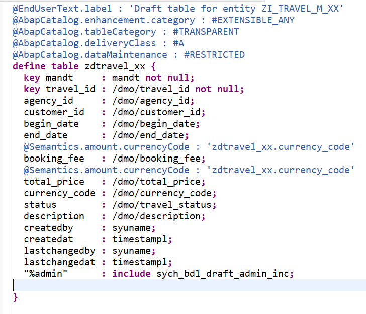
 
**Note: Whenever you change the BO data model, you can again use the ADT 'Quick Fix (Ctrl+1)' to generate again the draft table definition. This will update the table definition.**

8.	Save, activate and close the table.

9.	Now also create the draft table for the booking entity **zdbook_AO** using the ADT `Quick Fix` **(Ctrl+1)**'.
 
 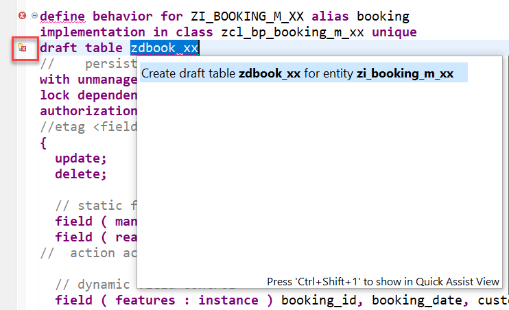
 
 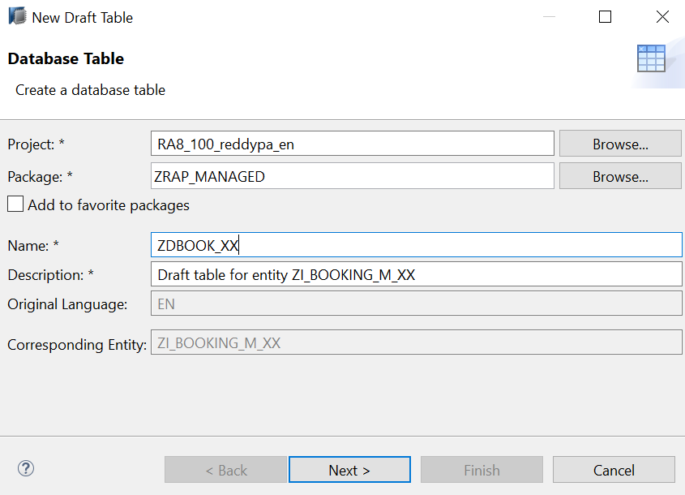
 
 

10.	Save, activate and close the table.
Some warnings are shown in the `Problem view.` You will now work on removing them.
 
 

11.	Replace the association definition in the base behavior definition to solve the warnings indicating that the associations are implicitly draft enabled as this is a draft enabled business object.
For this, use the code snippet provided below to replace the one currently defined in the `travel` behavior definition as shown on the screenshot.

`association _Booking { create; with draft; }`

 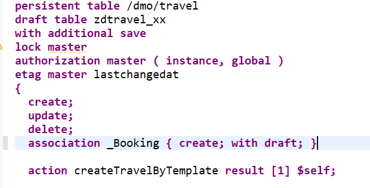
 
12.	Do the same for the **_Travel** association of the booking entity.
For this, use the code snippet provided below to replace the one currently defined in the booking behavior definition as shown on the screenshot.

 `association _Travel { with draft; }`

  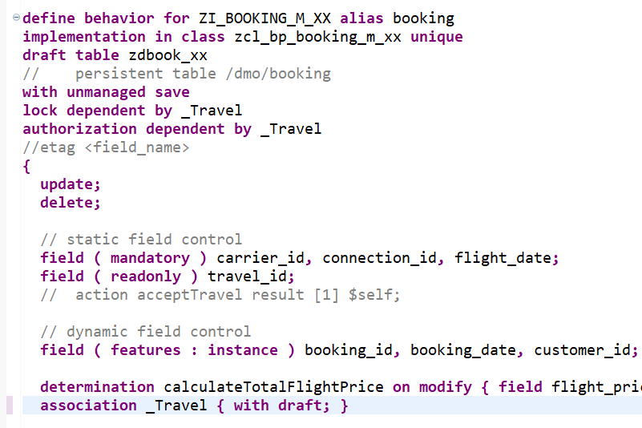

13.	Specify a `total etag field` in the `root` entity of your BO. This is required to identify changes to `active` instances in cases where the durable lock has expired. The field **LastChangedAt** will be used for the purpose in the present scenario.

For this, use the code snippet provided below to replace the one currently defined in the `travel` behavior definition as shown on the screenshot.

`total etag LastChangedAt`

 
 
14.	When a draft instance is going to be activated, the SAP Fiori elements UI calls the `draft determine action` **prepare** in the backend. This call takes place in a separate `OData changeset` to allow for saving the state messages even in case the activation fails due to failing validations.
In order to execute the validations during prepare, you need to assign them to the **draft determine action prepare** trigger.

For this, insert the code snippet provided below into the travel behavior definition as shown on the screenshot.

```
  draft action Resume;
  draft action Edit;
  draft action Activate;
  draft action Discard;
  draft determine action Prepare
  {
  }
  
 ```

  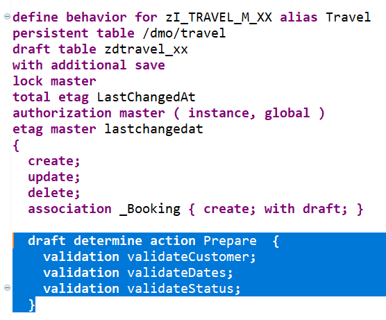

15.	Save and activate the changes.


<a id="exercise-2"></a>
# Exercise 2. Enable the draft handling in the projected business object
You will now enable the draft handling for the managed based business object (BO) with a few additions in the behavior definition.
1.	In the `Project Explorer`, go to your package and open the base behavior definition **ZITC_AO_C_FE_TRAVEL** - where **AO** is your chosen suffix – of your business object.

You can also use the shortcut **Ctrl+Shift+A** to open ABAP development object.

 

2.	Enable the draft handling in the projection, by adding the statement **use draft;** in the header section.

Otherwise the projection would behave like if no draft has been enabled for the business object.

`use draft;`

 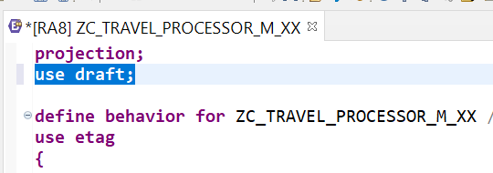

3.	Enable the draft handling for the associations exposed in the projection. For this, use the code snippets provided below to replace the respective statements in the behavior definition projection as shown on the screenshot.

Code snippet for the `travel` entity:

`use association _Booking { create; with draft; }`

Code snippet for the `booking` entity:

`use association _Travel { with draft; }`

 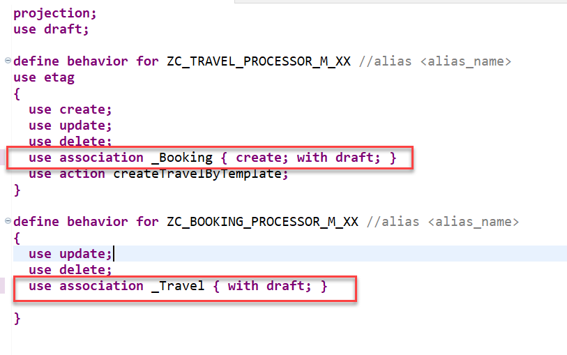

4.	Save and activate the behavior definition projection.
You are now done with the behavior implementations and can run and check the enhanced SAP Fiori elements `Travel App`.

5.	Launch the Travel app in your service binding **ZITC_AO_SB_V2**– where **AO** is your chosen suffix – or refresh (`F5`) it in the browser. Provide your ABAP user credentials if requested.

Press **Go** on the UI to load the back-end data.
First thing you will notice is a new filter field that allows for filtering on the Editing Status is now displayed in the filter area.
 
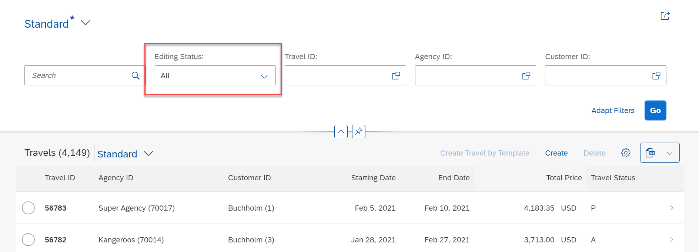

#### Solution 

```
projection;
strict ( 2 );
use draft;

define behavior for ZITC_AO_C_FE_TRAVEL //alias <alias_name>
{
  use create;
  use update;
  use delete;

  use action Resume;
  use action Edit;
  use action Activate;
  use action Discard;
  use action Prepare;

  use association _Booking { create; with draft; }
}

define behavior for ZITC_AO_C_FE_BOOKING //alias <alias_name>
{
  use update;
  use delete;

  use association _Travel { with draft; }
}

```

